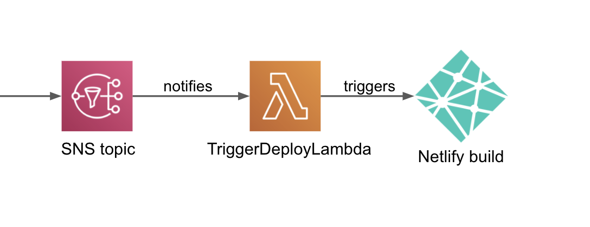
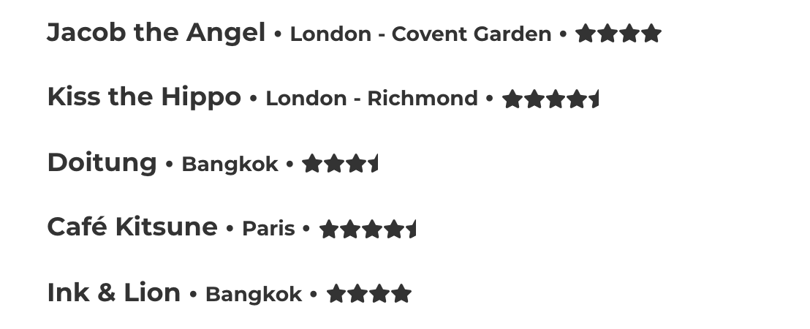
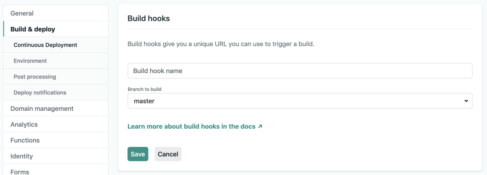
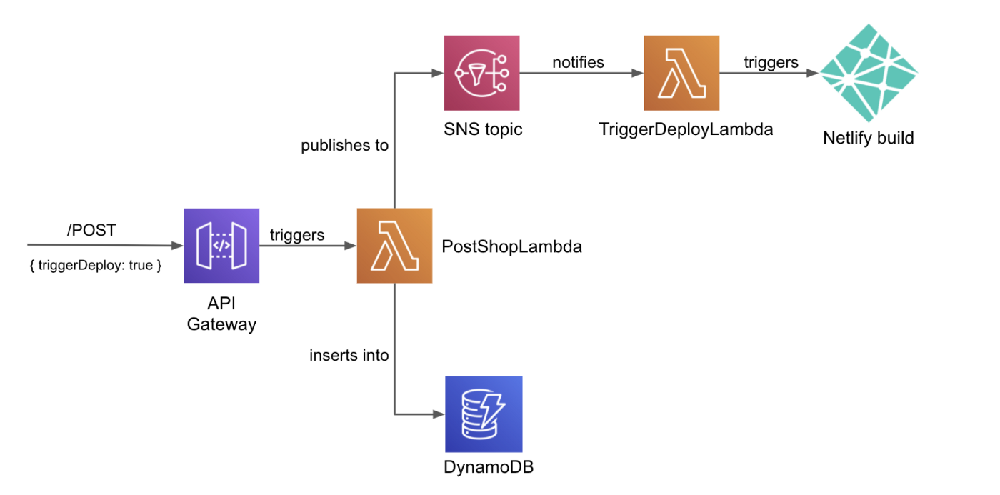

<small>Exploring my AST.</small>
 

Previously, [I wrote about](https://medium.com/better-programming/getting-gatsby-wrong-836c198eb6ea) updating my Gatsby website to fetch data at build time instead of at runtime. This means that the site only fetches data from external APIs during the build process, rather than every time a user visits the site.

I did this because my data was fairly static — it’s a [list of coffee shops](https://cpv123.netlify.app/coffee/) that changes just once a week.

<small>Sneak peek at the list itself. Some high scorers here.</small>
 

Build-time fetching comes with an improved UX and can even save some costs. But the downside of build-time fetching is that when the data changes — like when a new shop is added —the updated data won’t appear on the site until it’s rebuilt and redeployed.

This meant that after each new coffee shop was added, I would have to:

1. Add the new shop through my website (this would say it to the database).

1. Log into the Netlify console and trigger a build and deployment of the site.

It wasn’t exactly a long process, but whenever there’s more than one step, it leaves room for automation. Enter [Netlify build hooks](https://docs.netlify.com/configure-builds/build-hooks/).

## Automating Builds With Netlify Build Hooks

A build hook is a unique URL endpoint that you can use to trigger a build and deployment of your site. You can generate a build hook URL from the Netlify console under the site’s Build & Deploy settings:

Once you have the URL, just send a POST request to it and your site will be deployed from your chosen branch.

I already had an AWS lambda function responsible for saving the coffee shop to an AWS [DynamoDB](https://aws.amazon.com/dynamodb/) table, so I updated this lambda to also send a POST request to the build hook if I wanted a redeployment (if I checked the “should trigger deploy” box when adding the new shop through my website).

### Taking it further with an AWS serverless application

My initial system worked perfectly, but sometimes it’s fun to overengineer a side project.

Instead of having one lambda function saving the shop and also triggering the build, I wanted a lambda function for each responsibility.

The first lambda would save the shop, and the second lambda would trigger the build if one was required. Making these lambda functions communicate with each other was “simple” using AWS [Simple Notification Service](https://aws.amazon.com/sns/) (SNS).

This left me with the following architecture:

When a shop is added through the website, it kickstarts an entire AWS serverless application:

1. API gateway receives the form data and triggers the `PostShopLambda` function.

2. The `PostShopLambda` function receives the form data and always saves the shop to the DynamoDB table.

3. If the form data’s `triggerDeploy` parameter is true (the checkbox has been ticked on the form), then the `PostShopLambda` will also publish a message to a specific SNS topic.

4. Once the message lands on the SNS topic, the subscribing `TriggerDeployLambda` will see the message and know to retrigger a build and deployment of the site using the Netlify webhook.

Most of the work is done by the `PostShopLambda` function. It always saves the shop to the database and may also publish an SNS message to trigger a deployment if necessary.

These core parts of the function look like this:

`gist:cpv123/09cc3740b4bfcd90f515590548dbc30d#post-shop-lambda.js`

If a message is published to the SNS topic, the subscribing `TriggerDeployLambda` function will be invoked.

As I mentioned earlier, a build hook is just a URL that you can send a POST request to, meaning the `TriggerDeployLambda` function is incredibly simple:

`gist:cpv123/29e6ace1c8ee3f63fa82d04c28350464#trigger-deploy-lambda.js`

Notice that the URL also has a trigger title that appears in the site’s build list, making it easy to differentiate these automated deploys from others.

### AWS Serverless Application Model (SAM)

All of this was built using the [Serverless Application Model (SAM)](https://aws.amazon.com/serverless/sam/) that makes it easy to set up serverless applications on AWS.

The entire application is described in a single `template.yaml` file. This lists all of the application’s AWS resources (the lambda functions, the DynamoDB table, etc.) and also describes how these resources interact with each other through subscriptions, permissions, etc.

The full code for this example can be found [on GitHub](https://github.com/cpv123/serverless-application-coffee-shops).
