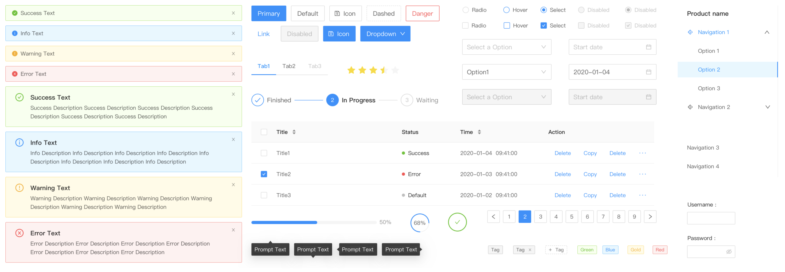

When it comes to building beautiful Web UIs at Amity, we do so in React using [antd](https://ant.design/docs/react/introduce) and [styled-components](https://styled-components.com/).

Antd gives us the base components - like buttons and modals - and styled-components allows us to customise the styling of these components in a way that is consistent and flexible.

## What is antd?

Antd is an open-source React library of UI components that follows the [Ant Design specification](https://ant.design/docs/spec/introduce). What this means is a huge offering of standardised UI components out of the box, which are well-built with accessibility in mind.

These components are generally atomic in nature such as simple alerts and buttons, although some are slightly more complex like file upload components and stateful forms.

### What we love about antd

As with any open-source library, it’s good to have an active community supporting and using it. With antd this is certainly true - it currently has 62k stars on GitHub making it possibly the largest React components library out there, and there’s constantly work being done on the project.

Antd also has a great website (as you might expect) with clear documentation and thorough examples for all components. The site is of course built using antd components, and so it’s a great place to see them live!
Two features that we love most:

**1. Internationalization support.** This means you can have your components translated into many different languages (currently 56).

This is particularly important for us at Amity given that at a minimum our applications must support both English and Thai language.

Configuring translations is simple - just wrap your application in a `ConfigProvider` and pass the user’s current language.

`gist:cpv123/f5a58c64837a9f519ff031f0fca96e65#antd-translate.js`

**2. The Form ‘component’** - which is a whole lot more than just a UI component.

Often when building forms you need a UI component library for the individual components - like inputs and buttons - but the form state and form validation must be handled manually or using another library altogether. For example, you might use [Material-UI](https://material-ui.com/) for the components and [Formik](https://formik.org/) for the form behaviour.

But with antd, you get all of this from just the [Form component](https://ant.design/components/form/) - the components, the layout, the state management, initial values, the validation, and more.

Here’s a simplified example of what a phone number field would look like in an antd form, including some basic phone number format validation:

`gist:cpv123/45c117400d620ace29b527390df870b6#antd-form-example.js`

## What is/are styled-components?

Styled-components is an extremely popular CSS-in-JS library - this means that it allows you to write CSS using JavaScript. Moreover, the resulting CSS will be scoped to specific components meaning there’s no risk that it’ll accidentally style something else as well.

The styled-components API is great because it feels as though you’re writing real CSS - especially when you’ve got an IDE extension installed for syntax highlighting!

`gist:cpv123/41320133c2bf5ece15b5ec9a5a9b703a#styled-example.js`

### What we love about styled-components

Like with antd, the popularity of styled-components means that there is a great community supporting and improving the project.

But ultimately what’s best about styled-components is that it allows you to write incredibly powerful styles in a way that is easier than traditional CSS.

Components built with styled-components take props like normal React components, meaning you can directly apply styles based on these. This is simpler than the more traditional method of applying classNames based on props which themselves define the desired styles.

And besides supporting all features of the CSS language, styled-components also allows you to nest your CSS selectors just like in Sass.
Two features that we love most:

**1. Extending and overriding the styles of existing components.** With styled-components you can take an existing component - one that may already have lots of styling - and change this to match your needs. This is exactly how at Amity we enhance our antd components with custom styles.

What’s more is that you can make sure that your custom styles take precedence over any existing styles:

`gist:cpv123/7a32eebb809ecd37f2a6ffa1984125d5#styled-component-override.js`

Each `&` gets replaced with the generated class and so the specificity of styles will increase as you add more &s - there’s no need for using the dreaded `important!`

**2. Global theme for consistent and configurable styles.** Styled-components offers a `ThemeProvider` component which takes a theme object and makes this object available to all styled-components underneath it.

The theme object can contain anything - typically various colors and maybe some spacing or breakpoints values.

`gist:cpv123/5e0515539e5d5bda8f4b99c63a05abd4#theme-provider.js`

Being able to configure colors like this is crucial for us at Amity, where we have to deploy the same web applications to multiple different customers, all of whom have their own color scheme.

For each deployment, we set the value of env variables according to the client’s color scheme and use these in the ThemeProvider theme object. Changing the value of a few env variables can then change an application’s entire theme.
