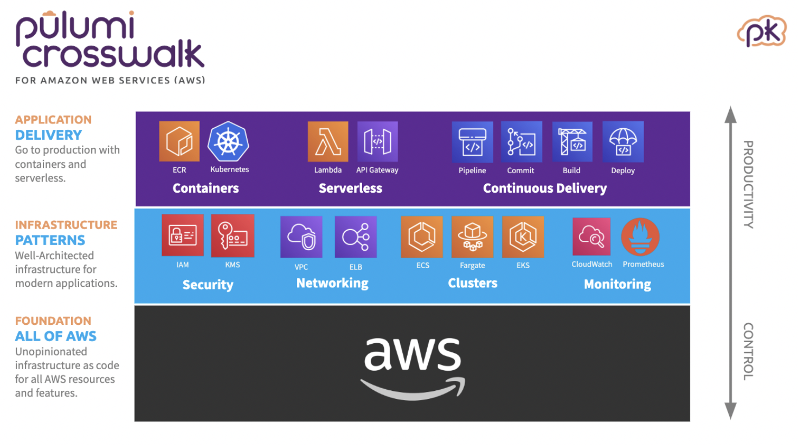
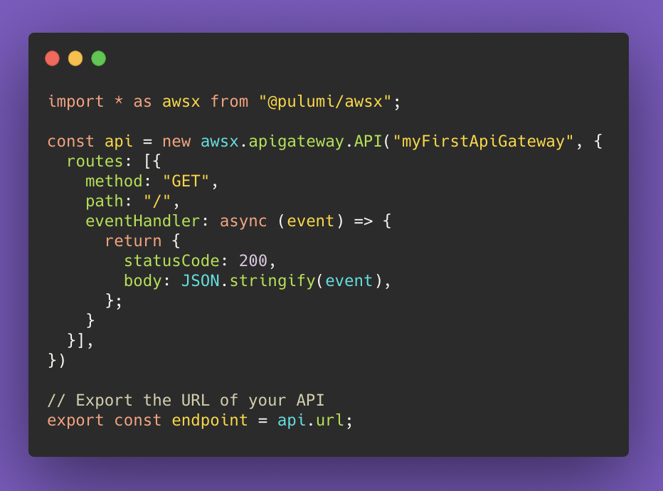

Moving from frontend development to full-stack development can feel like a daunting task, but the journey can be made a lot easier by using the right tools to help you get there.

Over the last few years, my job has changed a lot, with the overall trend being from frontend to full-stack. Spending less time with React, and more time building APIs, managing database migrations, and deploying AWS infrastructure. But thanks to a few key tools, this change never felt like a giant leap, but more like a natural transition:

1. **NextJS** for building a serverless backend with NodeJS

1. **Hasura** for designing databases, and building an event-driven architecture

1. **Pulumi** for deploying infrastructure onto the cloud

## NextJS

If you’re a frontend developer, then you’ve heard of [NextJS](https://nextjs.org/). As it says on the website, NextJS is a “React Framework for Production”, which admittedly doesn’t sound like anything more than a frontend tool. But in reality, NextJS offers much more.

It’s a server-side framework where you can build web applications with React as promised, but you can also build a backend with NodeJS. A NextJS backend is typically built using [API Routes](https://nextjs.org/docs/api-routes/introduction) — serverless lambda functions which can behave as REST APIs or a GraphQL server.

Often these API routes will be part of a NextJS application which includes a React frontend, but this doesn’t have to be the case. I have a few NextJS projects that contain only backend code — they don’t even have React installed as a dependency.

A simple `create-next-app`&nbsp; command bootstraps a project where you can write free lambda functions, with TypeScript support, Webpack 5 compilation, and easy deployment onto the cloud using [Vercel](https://vercel.com/).

Embrace NextJS as a serverless backend framework and it will help to bridge the gap between frontend and backend development.

## Hasura

[Hasura](https://hasura.io/) offers a gentle way into the world of relational databases: schemas, migrations, permissions, and event triggers. All of which would usually be quite daunting for a frontend developer.

Hasura’s core functionality is to provide an “instant GraphQL API” on a database. Give Hasura a database and in return, you’ll instantly get a GraphQL API that supports complex queries, mutations, bulk actions, and more.

The Hasura UI console makes it easy to build this database from scratch — adding tables, relationships, and permissions all with just clicks. Updates made through the UI will generate up and down migration files and put them straight into your project.

One of my most used Hasura features is the [event triggers](https://hasura.io/docs/latest/graphql/core/event-triggers/index.html). These allow you to listen for specific database events and in response invoke webhooks to carry out custom logic based on this event.

You can configure the retry logic, and view the logs for processed events and invocations. Hasura event triggers allow you to build an asynchronous, event-driven architecture for your backend. Not bad for a frontend developer.

## Pulumi

Last but not least, [Pulumi](https://www.pulumi.com/) is a tool that allows you to build and deploy your cloud infrastructure as code, using languages that as a frontend developer you’ll be familiar with: TypeScript and JavaScript.

Often, front-end developers feel especially disconnected from things like cloud infrastructure and deployments. Frontend and DevOps don’t have much in common. But the simplicity of Pulumi, along with its support for JavaScript/TypeScript makes these disciplines feel much more connected.

With Pulumi you can deploy to any cloud platform: AWS, Google Cloud, Azure, Kubernetes. I’ve been using it with AWS, allowing me to make use of [Pulumi Crosswalk](https://www.pulumi.com/docs/guides/crosswalk/aws/). Crosswalk aims to make “day one” tasks particularly easy, for example, deploying a REST API handled by a lambda function can be done with just a few lines of code:

If you’re looking to move from frontend to full-stack, or even just looking to dabble with the latter, then you should choose tools that make the transition feel more natural. NextJS, Hasura, and Pulumi are 3 that have I’ve found particularly helpful, but there are undoubtedly many more out there.
