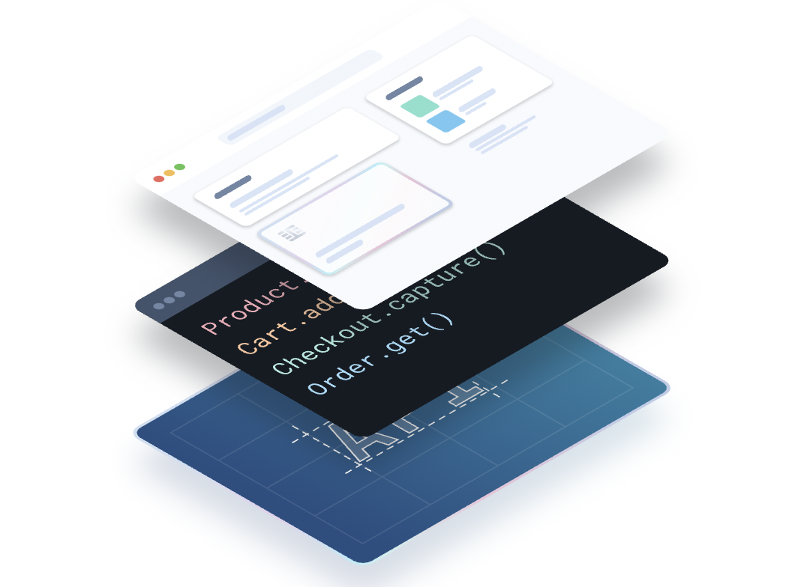
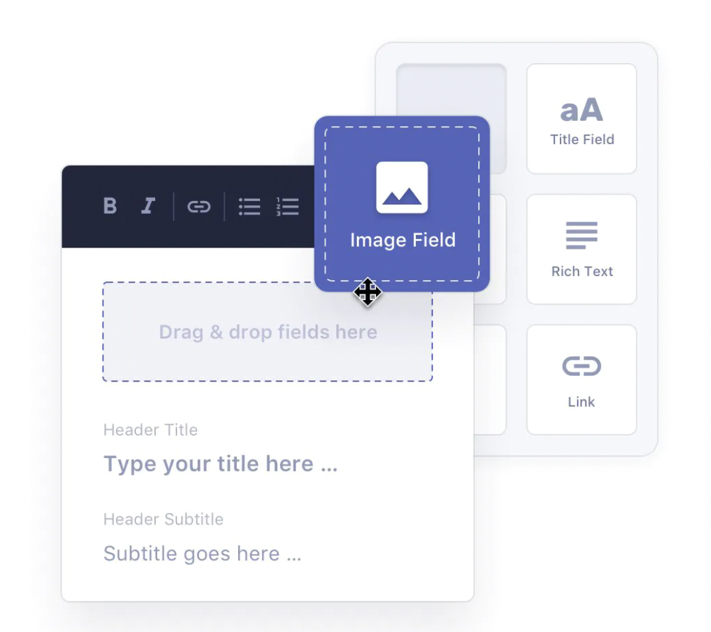

Next.js is a great choice for building an e-commerce site — this part needs no explanation. But even once you’ve chosen to use Next.js, building an e-commerce website requires a number of other tools and libraries that might not be such obvious choices.

I recently built a Next.js e-commerce site, one which relies on ‘headless’ solutions for content and e-commerce functionality. The tools I chose to make this happen worked nicely, complementing the Next.js architecture, and so I wanted to share them.

- [Commerce.js](https://commercejs.com/) for the ‘headless e-commerce’

- [Prismic](https://prismic.io/) for the ‘headless content’

- [Plausible](https://plausible.io/) for the simple analytics and insights

<small>Photo by <a href="https://unsplash.com/@markusspiske" target="_blank" rel="noopener noreferrer">Markus Spiske</a> on Unsplash</small>
 

## For the e-commerce: Commerce.js

I needed a “headless” e-commerce solution — one which takes care of the complex backend (checkouts, orders, products, etc.) but leaves me in full control of the frontend.

Nearly all of the mainstream e-commerce tools (like Shopify, BigCommerce) now support this approach, but they still feel weighed down by their traditional monolithic architectures.

[Commerce.js](https://commercejs.com/) feels different because it was built as a headless solution from its inception. Its APIs are just right for a headless approach — not too much and not too little.

> _From product displays to unique cart and checkout designs, our APIs give you control. You focus on the frontend implementation, we maintain and scale the backend APIs_ — commercejs.com

Getting started with commerce.js on Next.js was very easy thanks to their Next.js [demo apps](https://github.com/chec/commercejs-chopchop-demo) and [tutorial docs](https://commercejs.com/docs/community/create-a-product-listing-with-next-js/). And I was particularly pleased to find some tutorial docs showing how to integrate custom payment methods, which for me in Thailand was essential (where Stripe is not supported!)

One limitation I experienced with Commerce.js was the lack of support for multiple languages, for example, product names can be defined in one language only. However, with some advice from the team on their Slack channel, I was able to make it work.

## For the content: Prismic CMS

I was quick to choose Primsic as my tool for content (headless CMS), but only because I’d been recommended it by a friend, and I liked the look of [their website](https://prismic.io/). I did make sure that they had good support for content in multiple languages though, given that I needed English and Thai versions. I was quick to choose but happy with the choice.

Prismic has specific [documentation](https://prismic.io/docs/technologies/home-prismic-and-nextjs) for Next.js, which meant that the integration was easy. Very quickly I had a consistent workflow that I could apply for each page on the site: write the content, fetch the content for correct language, and using it to pre-render the page.

## For the insights and analytics: Plausible

It’s important to know how your website is being used by customers so that you can learn and improve — which pages are being visited, where customers are coming from, which buttons are being clicked, which errors are occurring,

To gain insights like this, most people choose Google Analytics. But I wanted to avoid Google Analytics for two reasons:

1. **It’s a data-privacy nightmare.** Dropping cookies, tracking users across the web, and feeding targeted advertising. And whilst Thailand’s PDPA law has been _once again_ postponed, it’s a personal belief of mine that data privacy doesn’t need to be compromised just for some website usage insights.

1. **It’s too complicated.** The Google Analytics dashboard is overwhelming. So many menus, metrics, custom dashboard,s and reports. I didn’t have the time to learn it all, nor do I have the need for such complexity.

Thankfully, I found [Plausible.io](https://plausible.io/) which brands itself as a “simple and privacy-friendly alternative to Google Analytics” — exactly what I was looking for.

> _The goal of Plausible Analytics is to track overall trends in your website traffic, it is not to track individual visitors_ — plausible.io

And the benefits of Plausible go beyond the two points I’ve just mentioned: the Plausible script is also 45 times smaller than the Google Analytics script, meaning that your site will remain fast just like Next.js should be. I used the [next-plausible](https://github.com/4lejandrito/next-plausible) package to integrate Plausible into my Next.js site.

There is one small downside though: unlike Google Analytics, Plausible isn’t free to use. There’s a free 30-day trial period, followed by a subscription plan of \$6 per month (or a slightly cheaper yearly plan).

If I was to build another site tomorrow, I’d choose the exact same tools. Together with Next.js, they provide everything you need to build a modern e-commerce site.
