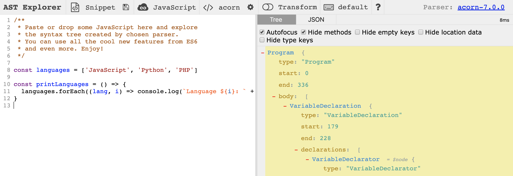
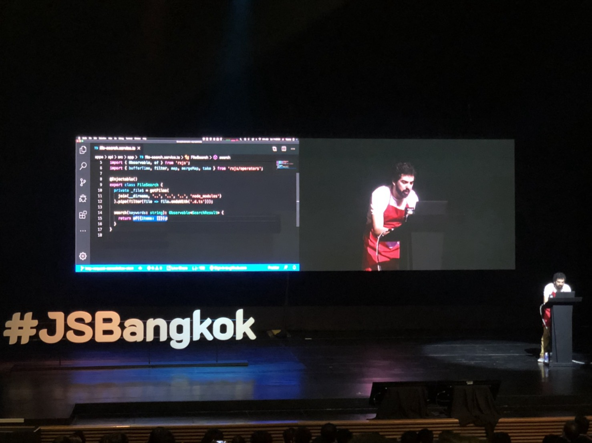

The JavaScript Bangkok 1.0.0 conference was my first look into a JavaScript community outside of Europe. Combining all of Bangkok’s JavaScript communities (React, Angular, Vue, NodeJS), this was the largest conference in Bangkok to date. Fortunately for me, it was also their most international conference, meaning that most of the talks were in English, and those spoken in Thai had (nearly) real-time subtitles for us farangs in the audience.

Here’s a quick summary of what I took from the day.

## Building your first malicious chrome extension

Chrome extensions — small, powerful, and sometimes evil. [Alon Kiriati](https://www.linkedin.com/in/akiriati/) demonstrated an **example** Chrome extension built from just a few small JavaScript files; the extension changed the displayed currency of an item’s price on Amazon whilst also adding his personal referral tag to the URL helping him to earn some money — pretty clever!

`gist:cpv123/fd49dcaf7464ba779d78c1b478112c76#chrome-extensions-redirect.js`

<small>Alon’s frighteningly simple ‘malicious’ code.</small>
 

Things got a little scarier when he demonstrated how easily an extension could act as a keyboard logger, capture screenshots, redirect to malicious websites, or even secretly use your computing resources to mine Bitcoin. Thankfully the Chrome store audit does a pretty good job of blocking extensions like these, nevertheless, I went and uninstalled my many unused extensions after this talk!

## The Art of Crafting Codemods

[Rajasegar Chandran](http://hangaroundtheweb.com/) spoke about using codemods — code to rewrite code — to make sweeping changes across a codebase safely and consistently. Something a little more intelligent than a sed command to find and replace.

He showed how this was possible using tools such as [AST Explorer](http://astexplorer.net/) and Facebook’s [jscodeshift](https://github.com/facebook/jscodeshift). I’d never heard of AST Explorer, but it looks pretty cool — you simply drop in some code and can view the abstract syntax tree (AST) that it generates. To his audience of JavaScript enthusiasts, Rajasegar cleverly described an AST as “DOM for your code”.

<small>Exploring my AST.</small>
 

## What happens when you cancel an HTTP request?

This one was a lot of fun — probably the highlight of the day. [Younes Jaaidi](https://marmicode.io) showed that cancelling an HTTP request on the frontend doesn’t necessarily reduce the workload for the backend.

Younes demonstrated a solution where HTTP cancellation did, in fact, happen end-to-end. He did so by ‘adopting a reactive approach and using observables everywhere’ with [RxJS](https://github.com/ReactiveX/rxjs) and [NextJS](https://nestjs.com/), which I have to admit, is now a very tempting combination. Younes’ himself has written a great [article about the topic](https://medium.com/marmicode/end-to-end-http-request-cancelation-with-rxjs-nestjs-909389c9d4bd).

<small>Younes thinking reactive in his ‘coding apron’</small>
 

## Optimization design patterns — from games to web

[Yonatan Kra](https://yonatankra.com/) spoke about how your app’s performance can be improved by utilizing techniques that are heavily used in gaming — where seamless user experience is crucial. He called out JavaScript developers as thinking only about the browser, and not the underlying machine, which is probably true for most (myself included).

A number of topics were covered, but my favourite was the Flyweight Design Pattern which is a method to minimise memory usage. The pattern achieves this by sharing as much data as possible between similar objects. Yonatan spoke about this in the context of sending data over a network — the flyweight pattern suggests that you extract the shared data and send only a single instance of this along with the rest of the now-thinned-out data. The receiver then needs to know how to piece it back together.

It sounds fairly abstract, but Yonatan gives a [simple example](https://yonatankra.com/reducing-network-traffic-with-the-flyweight-design-pattern/) using an Express server: the second route sends less data overall, but notice how it also sends an additional piece of static (shared) data.

`gist:cpv123/989b65c67a5a8025ab8e27baec59a8c6#flyweight-data-express.js`

<small>Alon’s frighteningly simple ‘malicious’ code.</small>
 

## A journey of building large-scale reusable web components

[Varayut Lerdkanlayanawat](https://github.com/lvarayut) spoke about building a reusable component library for the AWS console. If you’ve ever taken a look at AWS console, I’m sure you’ll agree that it’s definitely in need of some consistency.

The console is built by many teams, not all of whom are using React. Not wanting to build two libraries (one for React, one of Vue etc), they first considered using web components but ruled this out due to IE issues even with polyfills. And so, vanilla JavaScript was chosen one. It’s great to hear that not everything needs a fancy library or framework. Talking of which though, Varayut did speak about [percy.io](http://percy.io), which is a tool used for automated screenshot testing to help catch ‘visual bugs’.
