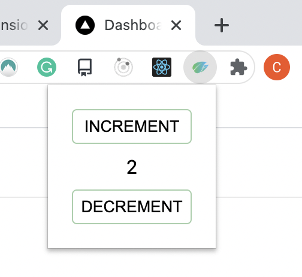
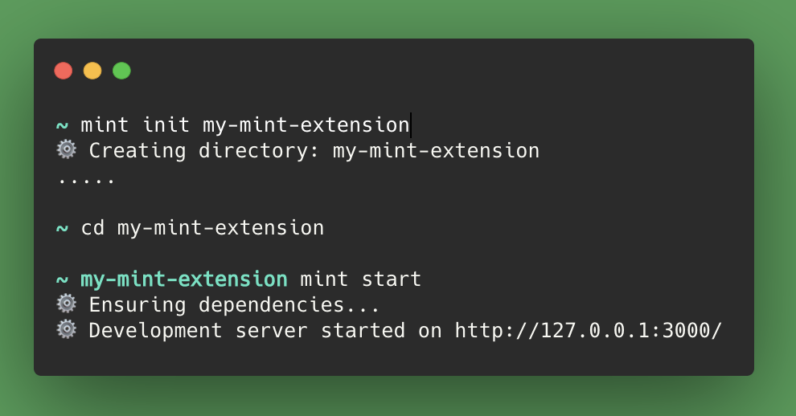
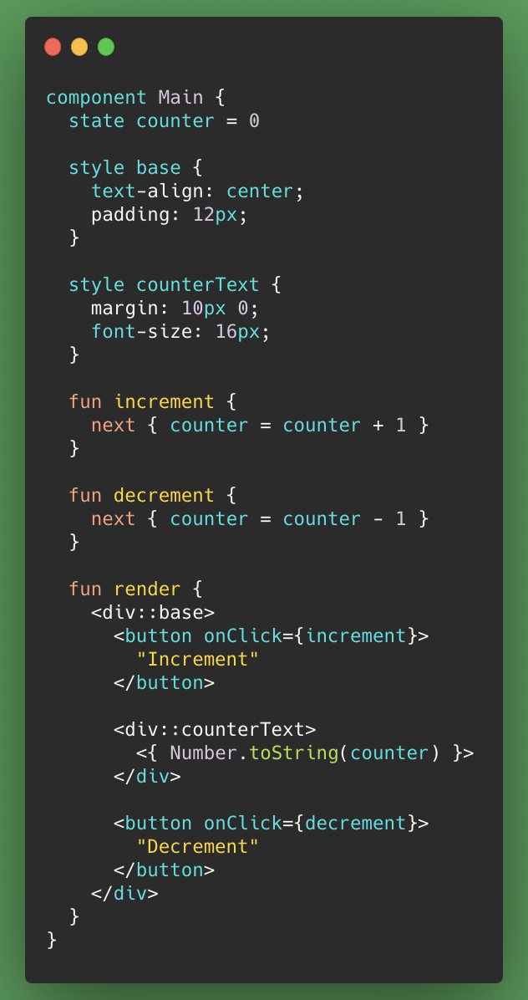
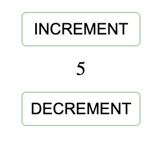
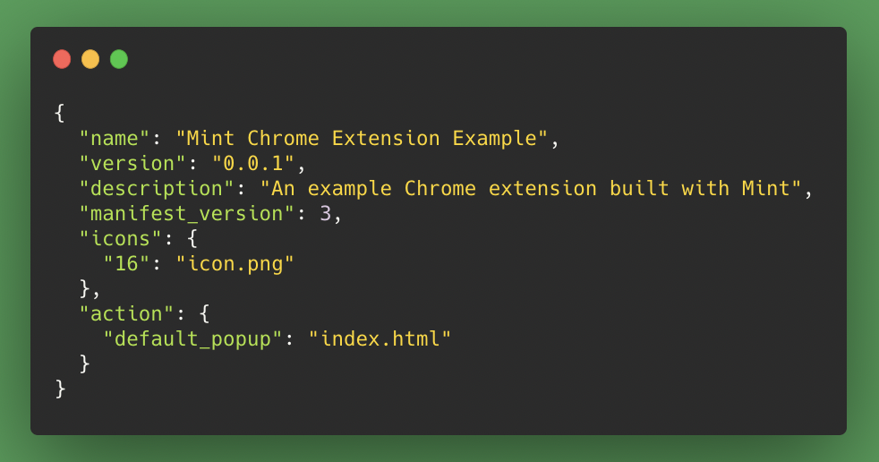
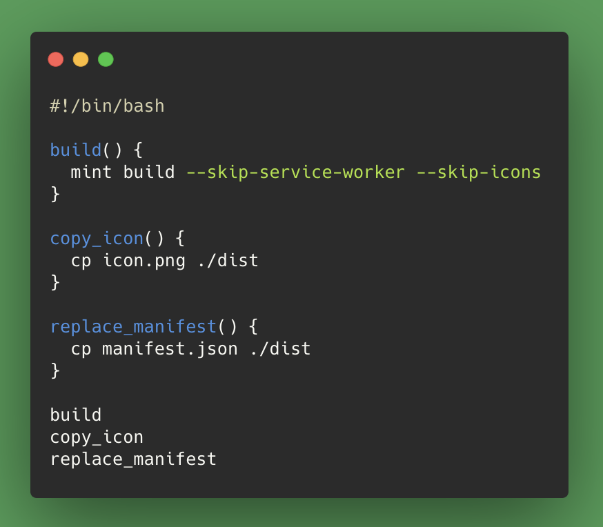
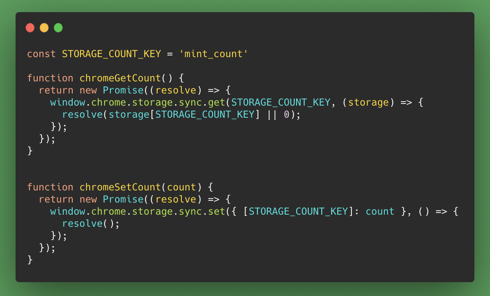
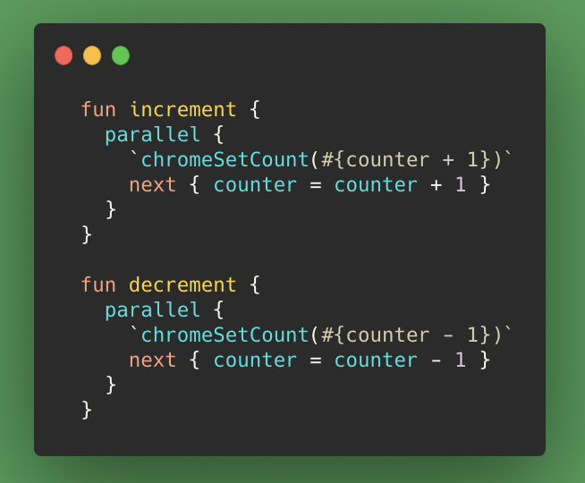
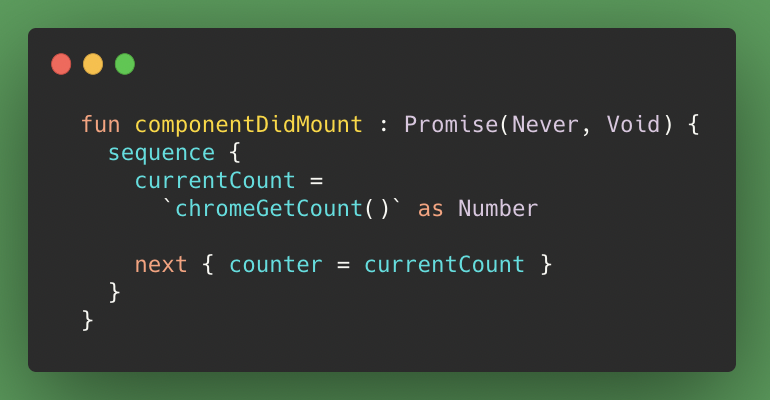
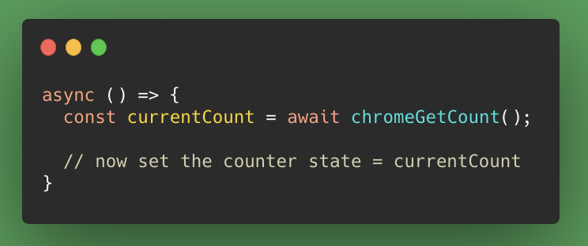

In my [last article](https://betterprogramming.pub/leave-javascript-aside-mint-is-a-great-language-for-building-web-apps-3ce5a6873d48), I discussed why I enjoyed using [Mint](https://www.mint-lang.com/) to build a small web application —more specifically, to build a Chrome extension popup.

Building a Chrome extension with Mint is mostly straightforward, but I encountered a few hurdles along the way. Today, I’ll explain how to:

1. Quickly get set up developing a Mint Chrome extension.

1. Add some functionality using the Chrome Storage API.

In this article, we’ll build a demo Chrome extension. The code is available [on GitHub](https://github.com/cpv123/mint-chrome-extension-example).

## What Are We Building?

Our demo Chrome extension will be a simple counter where the count value is stored in Chrome’s browser storage. The counter value will be persisted between tabs, when the browser is closed, and will even be synced to other Chrome browsers that a user is logged into.

To see a more complex Chrome extension built with Mint, take a look at the [code for GitHubGo](https://github.com/cpv123/github-go-chrome-extension/tree/master/mint). It’s an extension that uses Chrome’s Omnibox and Storage APIs and demonstrates much more of Mint’s built-in functionality for building web apps.

## How To Build a Chrome Extension With Mint

Building a Chrome extension with Mint can be broken down into three parts:

1. Setting up a normal Mint web application as the extension’s popup — the small UI which shows when you click on the extension icon in the toolbar

1. Building the application into a Chrome extension format by customising the default Mint production build

1. Adding some functionality with Chrome APIs using [Mint’s interoperability with JavaScript](https://www.mint-lang.com/guide/reference/javascript-interop)

### 1. Start a new Mint application

Scaffolding a new Mint application is easy. First, [install Mint](https://www.mint-lang.com/install) and then follow [these instructions](https://www.mint-lang.com/guide/getting-started/using-the-cli) to initialise and run the new application with the `mint init`&nbsp; and `mint start`&nbsp; commands.

Your terminal should now look something like this:

At [http://localhost:3000](http://localhost:3000/), you should have a “Hello Mint!” welcome message from your running Mint application.

Now let’s turn this into a basic counter application. In the `Main.mint`&nbsp; file, define a `counter`&nbsp; state to hold the count value and display this value along with buttons to increase and decrease the count.

If you’re unfamiliar with the Mint language, components, or styling, then take a look at [the docs](https://www.mint-lang.com/guide/getting-started/the-main-component).

After applying some additional style to the buttons (style not included in the code above), the application should look like this:

### 2. Build the application into a Chrome extension format

We can build our Mint application with the `mint build`&nbsp; command, which will bundle all production-ready assets into a `dist`&nbsp; directory. These assets will be HTML and JavaScript files, a manifest JSON file, and lots of icons.

First of all, we need to remove a few things from this build:

1. The service worker because in the `index.html`&nbsp; file, the service worker gets registered in an inline script. According to the [Content Security Policy](https://developer.chrome.com/docs/apps/contentSecurityPolicy/), inline scripts aren’t allowed in Chrome extensions.

1. The icons simply because Mint generates many icons of different sizes, but we only need one of them for now.

Conveniently, there are flags that we can pass to the build command to handle both of these:

    mint build --skip-service-worker --skip-icons

Even though we’ve just removed all the generated icons, we still want one icon to be used as the extension’s favicon so that it’s recognisable in the toolbar. Choose a small image (ideally square or circular), save it in the project root, and then copy it into the `dist`&nbsp; directory:

    cp icon.png ./dist

Finally, we need to replace the generated `manifest.json`&nbsp; file with one that defines our Chrome extension.

All Chrome extensions require a `manifest.json`&nbsp; file that is there to describe the extension (its name, version, required browser permissions, and much more). Define a `manifest.json`&nbsp; file in the project root that looks like this:

Notice that it’s defining `index.html`&nbsp; as the `default_popup`&nbsp; and also using the icon.png file as the extension favicon. Later on, we will come back to add some more attributes like the required browser permissions.

Copy this new manifest file into the dist directory to replace the Mint-generated one:

    cp manifest.json ./dist

Everything we’ve just done to prepare this build ready for a Chrome extension can be handled by a single [shell script](https://gist.github.com/cpv123/6a8511f5484c5851196c3898e1e3b32e) that we’ll call `build.sh`:

After remembering to allow execute permission on this script file (`chmod 755 build.sh`), we can build our application by running `./build.sh`&nbsp;. The built output into the `dist`&nbsp; directory will now be ready for testing in Chrome.

In Chrome, go to `chrome://extensions`&nbsp; and ensure that you’re in “Developer mode.” Click the “Load unpacked” button and select the `dist`&nbsp; directory that contains our most recent build of the counter application.

The counter extension should now be available to test out. Click on the extension’s icon in the toolbar and change the count value. The value will change as expected, but each time the extension’s popup is closed and reopened, the count will be reset to zero.

In the next and final part of this article, we’ll make the count value persistent using the Chrome Storage API.

### 3. Making it useful with JavaScript and the Chrome Storage API

At this point, we need to take a small break from Mint and write some plain JavaScript. This JavaScript will use the [Chrome Storage API](https://developer.chrome.com/docs/extensions/reference/storage/) to do two things:

1. Save the “count” value into Chrome storage.

1. Retrieve the “count” value from Chrome storage.

Create a file named `js/index.js`&nbsp; and write a function for each purpose — both of which should return a promise because of the asynchronous nature of the Storage API:

Before our extension can make use of these JavaScript functions, we need to update some configuration in the `mint.json`&nbsp; and `manifest.json`&nbsp; files.

Tell the Mint application to include this new JavaScript file in the build. In `mint.json`, add a section for “external JavaScript”:

    "external": {
      "javascripts": [
        "js/index.js"
      ]
    }

And tell Chrome that our extension now needs permission to use Chrome storage. In `manifest.json`, add a section for “permissions”:

    "permissions": [
      "storage"
    ]

Finally, our Mint extension is ready to start using Chrome’s browser storage. The `chromeGetCount`&nbsp; and `chromeSetCount`&nbsp; functions that we defined (and included in the build as “external JavaScript”) are available globally in the final JavaScript build of the application. This means that in our Mint code, we can call these functions anywhere so long as we tell the Mint compiler that it’s JavaScript by wrapping it in backticks. Calling JavaScript functions within Mint code like this is an example of Mint’s [JavaScript interoperability](https://www.mint-lang.com/guide/reference/javascript-interop).

Our counter application is now dealing with two instances of the “count”: the value stored as local state in the Main.mint component and the value that will be kept in Chrome’s browser storage. The application needs to keep these two values in sync, meaning that when the increment or decrement functions are called, the count needs to be updated in both places:

You can read more about Mint’s `parallel`&nbsp; expression in [the docs](https://www.mint-lang.com/guide/reference/control-expressions/parallel).

Now that Chrome Storage is a _persistent_ source of truth, we can read the count value from here and initialise the component's counter state value with it. This needs to happen each time that the extension’s popup is opened (i.e. when the component first mounts):

Another possibly unfamiliar Mint expression is `sequence`&nbsp;, which you can read more about [in the docs](https://www.mint-lang.com/guide/reference/control-expressions/sequence). Using this here ensures that the `chromeGetCount()`&nbsp; promise has resolved to a value before the next line of code sets the counter state equal to that value. In JavaScript terms, the function becomes something like:

Finally, the extension behaves as expected:

- The count can be changed when the extension’s popup is open, updating the local state value and Chrome storage value.

- The popup will always open showing the current value by reading it from Chrome’s storage.

## Conclusion

Whilst Mint might not be an obvious choice for building Chrome extensions, it certainly isn’t a bad choice.

Building web applications with Mint (such as Chrome extension popups) is easy and very fast, and Mint’s ability to work with JavaScript code means that it’s a well-equipped language for Chrome extensions.
