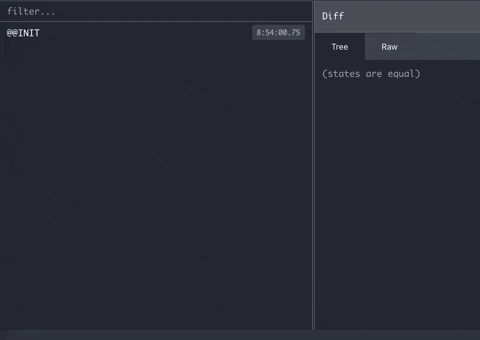
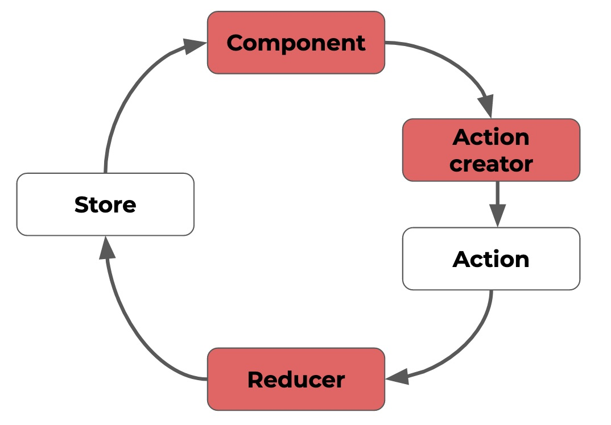

React Redux does a lot to optimise an application's performance, but the `mapStateToProps`&nbsp;function can leave much of this effort wasted, if not written with care.

```
connect(mapStateToProps)(WrappedComponent)
```

These functions play a seemingly simple role: tell connect which data to take from the store and to reshape that data if necessary, before it gets passed on as props to the wrapped component.
However, there are some important facts about `mapStateToProps`&nbsp;that are often forgotten:

1. They run every single time the store changes, or in other words, they run a lot 🏃‍
2. They have a huge responsibility: to determine if a component should re-render ♻️

Ignoring these facts can lead to performance issues in an application, but they are issues that can be easily solved with any of the solutions outlined here.

### 1. mapStateToProps run often, so don't make them too expensive 💰

Straight from the React Redux documentation:

> _Whenever the store changes, all of the `mapStateToProps`&nbsp;functions of all of the connected components will run._

and for those functions taking both available arguments--`state` and `ownProps`--they're going to run even more often.



<center><small>Redux DevTools - lots of store updates, lots of mapping state to props.</small></center>
<br/>

Optimising functions that run frequently is good practice in general, but in the context of Redux (pardon the pun), it's done surprisingly badly. Possibly this is because developers get too caught up in keeping container components 'smart', and presentational components 'dumb'. This usually results in `mapStateToProps`&nbsp;functions that are a little too smart for their own good--they take lots of data from the store, do some complex reshaping of that data, possibly merge that data together, all to derive the required props for the wrapped component.

#### How to reduce the cost

The cleanest and most common way to reduce the cost of a `mapStateToProps`&nbsp;is to use memoized selectors from reselect, an approach recommended by Redux itself and probably by everyone that's ever tried it. These memoized selectors--those created using reselect's createSelector--will not recompute if their arguments have not changed, and will instead simply return their previous result.

Making selectors responsible for taking data from the store and returning the desired props means that potentially expensive computations will not run unnecessarily as part of `mapStateToProps`.

`gist:cpv123/696be0e8adcddcd895d8e025f7c7244c#user-selectors.js`

`gist:cpv123/3e4a1dfa4599cbc169fd4ff47d5fa0f0#mapStateToProps.js`

<center><small>It's hard to go far wrong with a function that looks anything like this one.</small></center><br/>

Memoized selectors are great not only for performance, but they're reusable, easy to maintain and test, and they look cool--basically a must-have for any large Redux application.

Another way to reduce the cost of `mapStateToProps`&nbsp;is to put all or part of the expensive computations elsewhere in the Redux lifecycle:

- action creators
- reducers
- the wrapped component's render method

Doing so in action creators or reducers has the potential benefit of being able to retain this derived data in the store, which can then be pulled out by `mapStateToProps`&nbsp;and passed on as props without further work.

The third suggestion--in the component's render method--tends to get particularly bad press, but at least here the calculation is only being run when the component is actually rendering, as opposed to in `mapStateToProps`&nbsp;where it's going to run whether or not a component render happens.



<center><small>The familiar Redux lifecycle, highlighting some alternative places to derive data for props.</small></center><br/>

Finally, there's the option of tackling the root cause and actually preventing a `mapStateToProps`&nbsp;function from running when it doesn't have to. This can be done using the areStatesEqual function which is available to Redux's connect through the options object argument:

```js
connect(
  mapStateToProps?: Function,
  mapDispatchToProps?: Function | Object,
  mergeProps?: Function,
  options?: Object,
)
```

This function can be used to check if a specific part of the store has changed, and if it hasn't i.e. the function returns true, the next and previous store states are considered equal and the corresponding `mapStateToProps`&nbsp;won't bother running. This is something worth reading more about because it's definitely one of the hidden gems of Redux 💎

`gist:cpv123/73557e25454d877fe91995219a46d14d#are-states-equal.js`
<br/>

### 2. mapStateToProps determines re-renders, so don't accidentally make nextStore !== previousStore 🤷‍♂️

When connect is running it's internal shouldComponentUpdate, it looks at the incoming result of `mapStateToProps`&nbsp;and compares each value in the object to that of the previous result using a shallow comparison; if any of them have changed then the wrapped component will re-render.

Unfortunately, using JavaScript it's particularly easy to accidentally make a piece of state not equal to its predecessor even if it looks the same--because remember that `{} !== {}`. This means that using methods that result in a new object or array reference will cause the shallow equality check to return false, causing the wrapped component to always re-render, whether or not it's actually needed. In Redux, where immutable data plays a key role, these methods are commonplace. But there are places where you want to see them (in reducers), and places where you might not want to see them (in `mapStateToProps`).

`gist:cpv123/6bba8c665dced0073fd9147bdecf0da5#map-state-with-new-objects.js`

<center><small>No hope for this one.</small></center><br/>

The above function shows a number of ways to accidentally caused this issue:

- basketContent is being derived using the array.filter method meaning it's a new array each time
- authentication is simply defined as a new object each time, and it's being built using the spread operator `...`&nbsp;which is also one to watch out for
- promoCodes is being derived using the array.slice method meaning it's a new array each time

#### How to avoid wasted renders

- Try to avoid defining props as new objects or arrays (like the authentication prop above)
- Be aware when using methods that create a new object or array reference (those mentioned above along with array.map, array.concat, etc)

Completely avoiding the use of these methods isn't necessary though, and is not what's being recommended. Instead, just be aware when using them, and know that there is a way to make them absolutely harmless--it's memoized selectors from reselect again. Putting the logic containing these methods within a memoized selector means that it'll only ever be run when it has reason to (when arguments to the selector have changed), in which case a re-render is most likely the desired outcome anyway.

Remember though, the memoization comes from reselect's createSelector function. Although something like

```js
const getBasketContents = state => {
  return state.basket.filter(item => item.stock > 0)
}
```

is often seen as a 'selector', it's actually just a regular function that in this case won't solve the issue causing wasted renders due to the use of array.filter.

### Summary

In reality, the two issues discussed here are actually closely linked: if a `mapStateToProps`&nbsp;is expensive to run, then it's probably causing unnecessary renders too. Expensive functions deriving data are most likely making use of these object-creating functions, and so the simplest solution is to use memoized selectors in your `mapStateToProps`&nbsp;functions. Doing so can solve both performance issues--expensive computations and wasted renders--as well as bringing many other benefits to a codebase and the developers working on it.

Believe it or not, though, the intention of this article was not only to encourage the use of selectors. In fact, even the great reselect has limitations: it's difficult to create selectors that take arguments, and sharing selectors across multiple component instances is relatively complex.

Hopefully, it's now clear that there are a variety of ways to ensure that `mapStateToProps`&nbsp;isn't negatively affecting performance:

1. Using memoized selectors
2. Moving expensive logic into action creators, reducers, or render methods
3. Using the areStatesEqual function available to connect

And given their simplicity, it's worthwhile considering all three options when looking to optimise the performance of a Redux application.
