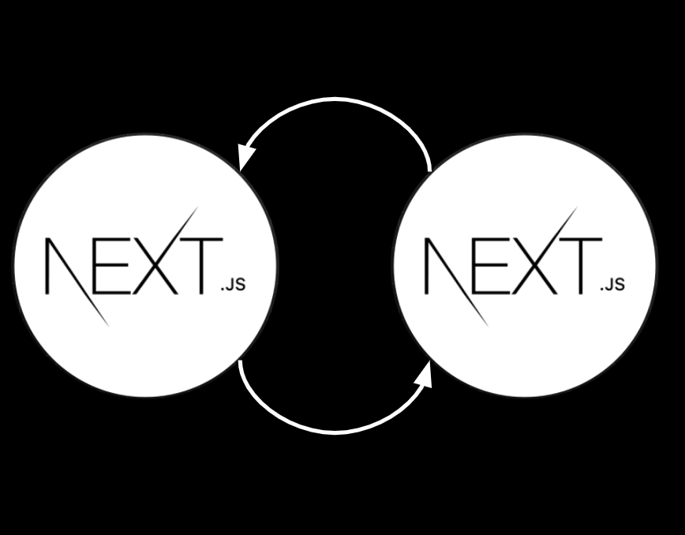
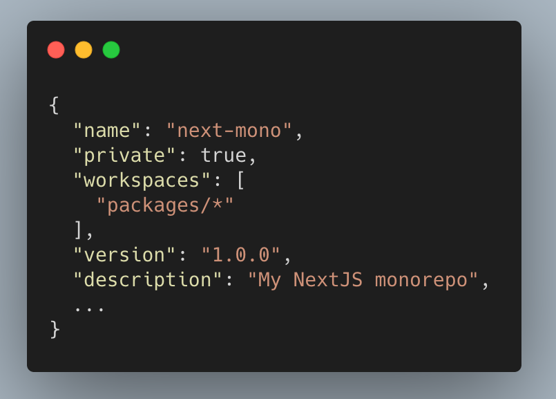
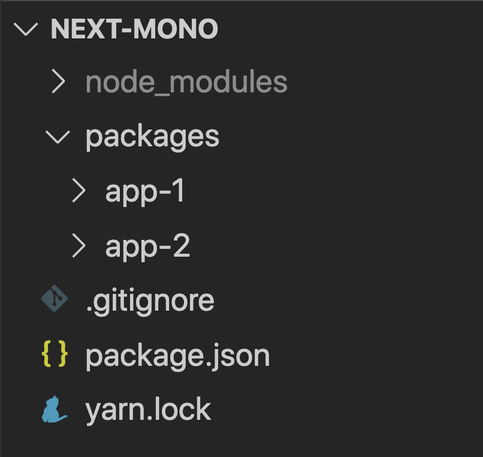
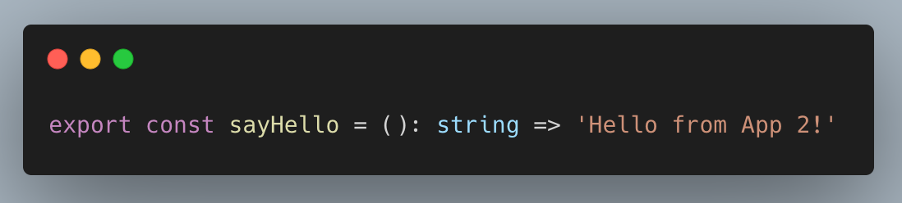
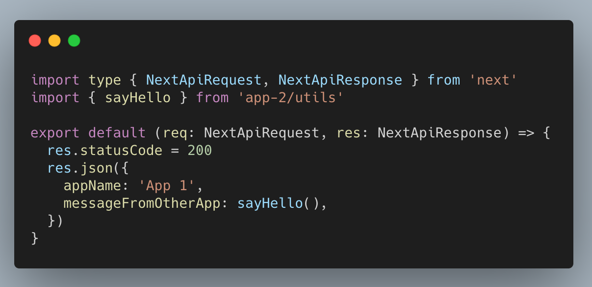
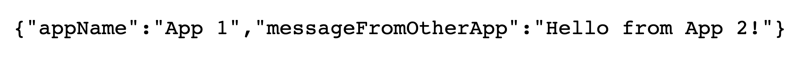
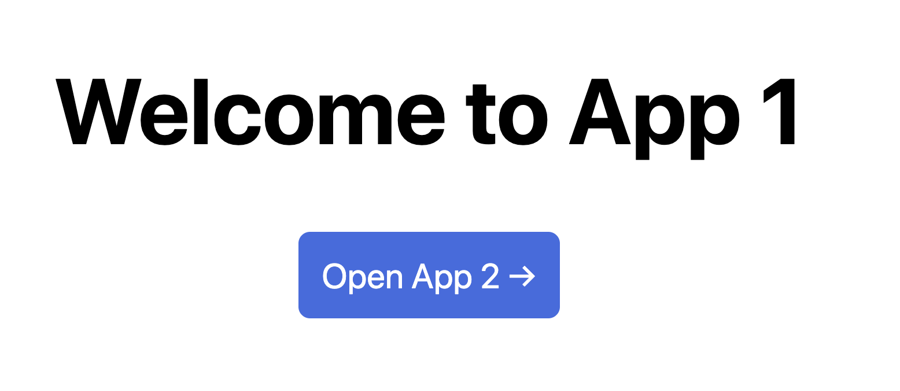
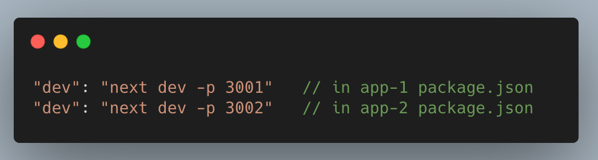
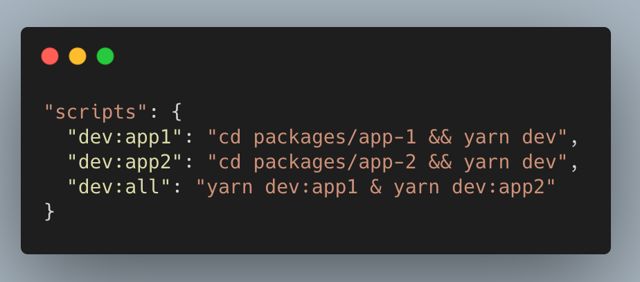

> _Sharing code between NextJS projects can be easy. With [yarn workspaces](https://classic.yarnpkg.com/en/docs/workspaces/) you can have multiple applications in a single repository — a monorepo — and use the [next-transpile-modules](https://www.npmjs.com/package/next-transpile-modules) plugin to allowing the importing of code from one into another._

<a href="https://github.com/cpv123/nextjs-sharing-code-monorepo" target="blank" rel="noreferrer noopener">See the example repo here</a>

I had a NextJS application which had become quite large, to the point where it made more sense to start migrating some of it to a new, separate NextJS application. But some code would be needed in both the original application and the new one.

The code I wanted to share was very simple — not worthy of its own repository, not worthy of building/publishing it and including it as an external dependency. _I just wanted to import the code from one application into another._

To achieve this, I built a simple monorepo — one repository containing both of my NextJS applications — which supported code sharing between the applications. This was made easy thanks to [yarn workspaces](https://classic.yarnpkg.com/en/docs/workspaces/) and the [next-transpile-modules](https://www.npmjs.com/package/next-transpile-modules) plugin.

## Setting up a NextJS monorepo with code sharing

### 1. Initialise the monorepo

Create an empty directory and run some setup commands:

    $ mkdir next-mono
    $ cd next-mono

    $ npm init
    $ git init

Add a `.gitignore`&nbsp; file making sure that at least `node_modules`&nbsp; are ignored:

    $ touch .gitignore

    $ echo "/node_modules" > .gitignore

To start using yarn workspaces, you need to add two options to the project’s `package.json`&nbsp; file:

- `"private": true`

- `"workspaces": [ "packages/*" ]`&nbsp; which refers to a directory that we’ll create in the next step.

After this, your `package.json`&nbsp;will look something like this:

### 2. Creating some packages

“Packages” is a standard name when using yarn workspaces. In our case, we will have two packages — each one being a NextJS application.

Create the packages directory (referenced in `package.json`&nbsp; in the previous step) and inside it create two NextJS applications using [create-next-app](https://nextjs.org/docs/api-reference/create-next-app):

    $ mkdir packages
    $ cd packages

    $ npx create-next-app app-1
    $ npx create-next-app app-2

_**Note:** if your NextJS applications already exist, then you can instead just move these existing applications into the monorepo instead of creating new ones. But remember that when doing this, you’ll probably need to combine multiple git repositories into just one following [something like this](https://medium.com/@filipenevola/how-to-migrate-to-mono-repository-without-losing-any-git-history-7a4d80aa7de2)._

At this point your IDE should be showing a project structure like this:

We can start to see how a yarn workspace behaves: the dependencies for each NextJS application (e.g. react, react-dom, next) have been installed into the shared `node_modules`&nbsp; at the project root (the one listed in the image above) rather than into the `node_modules`&nbsp; of each application.

This shared `node_modules`&nbsp; also contains a reference (via a symlink) to each of our applications `app-1`&nbsp; and `app-2`, making their code available for import too. This is exactly what we’ll be doing later on.

<small>Yarn workspace packages in node_modules — with VSCode showing them as symlinks to the original package directories.</small>
 

### 3. Install common devDependencies

With yarn workspaces, you can safely install `devDependencies`&nbsp; at the root of the project so that they’re listed in the `package.json`&nbsp; of the monorepo itself.

When doing so, you’ll need to confirm that this is your intention using the `-W`&nbsp; flag. Without the flag, yarn will politely stop you with the following message:

    error Running this command will add the dependency to the workspace root rather than the workspace itself, which might not be what you want...

But installing into he workspace is what we want in this case because as mentioned, we’re installing `devDependencies` which will be shared by multiple packages in the monorepo.

The first and most important of which is [next-transpile-modules](https://www.npmjs.com/package/next-transpile-modules). This library will allow us to transpile the `app-1`&nbsp; and `app-2`&nbsp; code that lives in the project’s `node_modules` allowing it to be imported like regular dependencies.

Import this as a `devDependency` into the project root:

    yarn add -D -W next-transpile-modules

_Note: make sure that it’s installed version 6 or above._

The second dependency is not essential but a personal preference: TypeScript. You can skip this one, but if you’re looking for some type safety like me, then again go into the project root and run the following command to install TypeScript and the types necessary for NextJS:

    yarn add -D -W typescript @types/react @types/node

And then, create an empty `tsconfig.json` file in each application, which will be later populated by NextJS automatically.

    cd packages/app-1 && touch tsconfig.json

    cd packages/app-2 && touch tsconfig.json

### 4. Get ready to share some code

A couple of things need to be configured before we can finally start sharing code:

- Adding a main field to each application’s `package.json`

- Configuring the [next-transpile-modules](https://www.npmjs.com/package/next-transpile-modules) plugin

The [next-transpile-modules](https://www.npmjs.com/package/next-transpile-modules) plugin requires a valid main field defined in `package.json`. It doesn’t matter which file this field targets, so long as it’s there for both `app-1`&nbsp; and `app-2`.

In app-1/package.json and app-2/package.json add the field:

    "main": "pages/index"

Next, we need to tell [next-transpile-modules](https://www.npmjs.com/package/next-transpile-modules) which modules should be transpiled. The plugin can transpile anything from node_modules, which as we saw earlier, includes the code from both `app-1`&nbsp; and `app-2`.

Starting in `app-1`, create a file called next.config.js and configure the plugin to transpile code from `app-2`

<small>app-1/next.config.js</small>
 

Do the same thing in `app-2`, but this time specifying app-1 as the code to be transpiled:

    const withTM = require('next-transpile-modules')(['app-1']);

### 5. Finally share some code

To fully demonstrate code sharing between NextJS applications, we can use examples of both backend and frontend code:

- A utility function defined in `app-2` and used in an API route of `app-1`

- A link component defined in `app-2` and used in a page of `app-1`

Define a simple utility function in `app-2`, for example, a function saying hello:

<small>app-2/utils/sayHello.ts</small>
 

and then import this function into the default ‘hello’ API route in `app-1`

<small>app-2/utils/sayHello.ts</small>
 

The code for this API should already exist if the app was created with create-next-app, just remember to convert it into a .ts file if using TypeScript.

Running `app-1` locally with the yarn dev command will make this API available at [http://localhost:3000/api/hello](http://localhost:3000/api/hello). Navigating to this URL in our browser will show that the sayHello function from app-2 is working as expected:

<small>JSON response from http://localhost:3000/api/hello</small>
 

For the frontend code sharing: define a React component in `app-2`, for example, a link component which opens `app-2`&nbsp; into a new tab. Render this component in the homepage of `app-1`:

<small>app-1/pages/index.ts</small>
 

and then visit the page at [http://localhost:3000](http://localhost:3000) to see the link component in action:

These simple examples show that after the setup described throughout this article, you can seamlessly share code between NextJS applications. We’ve made the code from each application available through the monorepo’s `node_modules` folder, meaning it can be imported just like any other external dependency.

### 6. Bonus: a monorepo-style start script

To make it a true monorepo, we can add a script to the root of the application which will run both of our applications simultaneously.

By default, both of them will try to run in development mode on port 3000. To avoid a port clash, first, update the dev script in each `package.json`&nbsp; to run on different ports. For example:

And then in the root `package.json`, add the following 3 scripts

Now, running yarn dev:all will start both applications at the same time, with `app-1`&nbsp; running on port 3001 and `app-2`&nbsp; running on port 3002.
