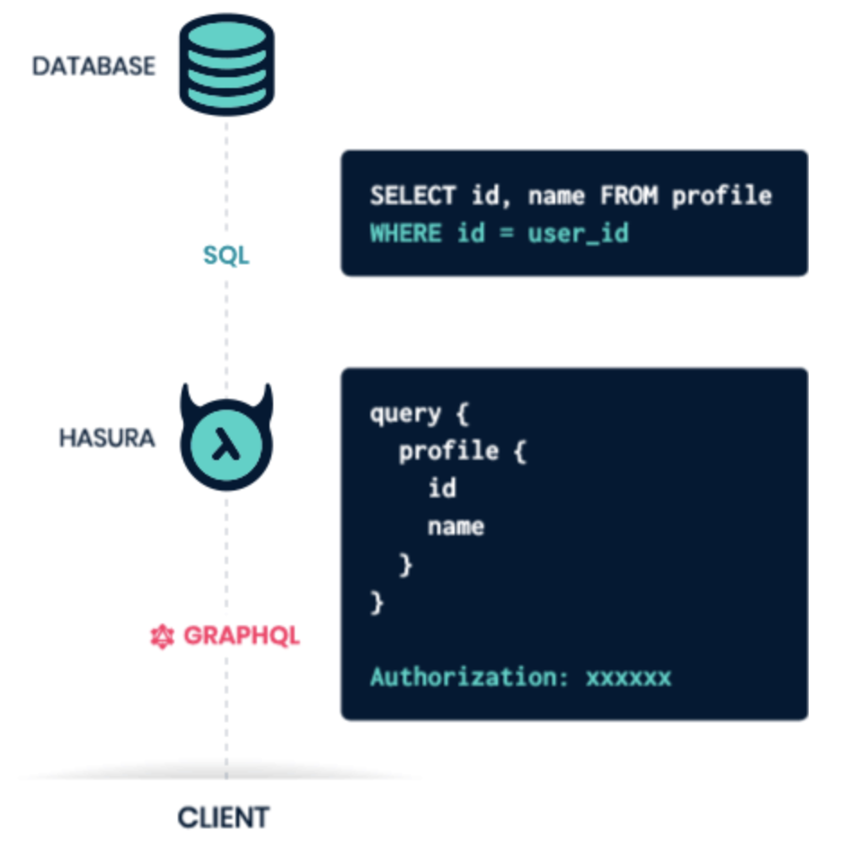
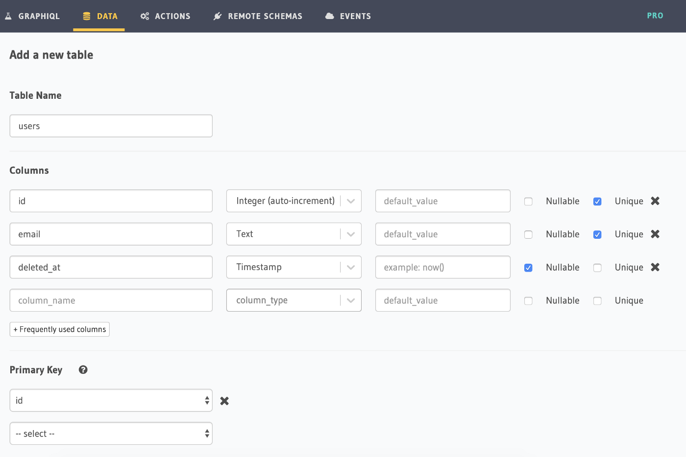
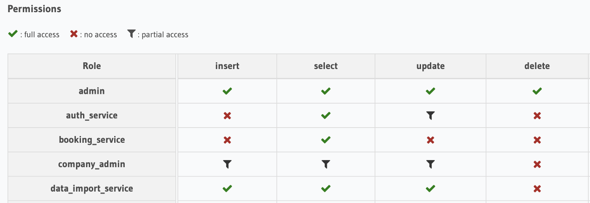

<small>Part I topics: NextJS and Hasura.</small>
 

My memories of the COVID-19 pandemic in many ways will be the same as most: a makeshift standing desk in the kitchen, a plummet in daily step-count, and a distorted view of hours, days and weeks.

Where my memories differ is when I think about the work I did at [Amity](https://www.amity.co/) during this time. Amity took on many exciting opportunities: helping hospitals to manage their potential COVID patients, helping companies, schools, and universities to work remotely, all whilst enhancing the core Amity products for existing clients.

During the few months that I stood at my desk in the kitchen (a stool placed on top of the table), I worked on 3 projects all with very different tech stacks. I wrote some good code and I wrote some bad code. I lost what feels like years of sleep, but more importantly, I gained what feels like years of experience.

I want to share some of these experiences and pass on some useful tips that I picked up along the way.

### Part I

- GraphQL with Hasura

- Rapid full-stack development with NextJS version 9

### Part II

- Build your own translation library

- Rediscovering higher-order components in React

### Part III

- Instant messaging and video with SonarKit and Jitsi

- An admin app with react-admin

## GraphQL with Hasura

Starting with what’s now my favourite technology: [Hasura](https://hasura.io/).

In its own words:

> ### _Hasura is an open-source service that can auto-generate a realtime GraphQL API on your Postgres database._

And this isn’t oversimplifying — give Hasura a Postgres database and in return, you’ll instantly get a GraphQL API that supports complex queries, mutations, bulk actions, and more.

It’s as simple as this:

1. Send a query or mutation to the GraphQL API

1. The Hasura Engine converts this into a highly optimised SQL statement that runs on your Postgres database

1. JSON response gets sent back

I was introduced to Hasura during project number 3: a completely new application which was primarily a database management system. This meant that a large part of the work was to design and implement the underlying data model.

The requirements for the project were changing frequently— how we had modelled some data on Monday might not work for Thursday’s requirement.

This is where Hasura proved so invaluable — using the Hasura console UI, it’s very simple to add or update tables, relationships and permissions. This meant that anyone in the team could make these sorts of changes, allowing us to just about keep up with the requirements.

<small>Building a database and GraphQL API with a few clicks.</small>
 

The header in the screenshot above shows a glimpse of Hasura’s full features. We made constant use of the built-in GraphiQL editor for exploring the auto-generated GraphQL API, and we built Hasura actions to trigger custom business logic for certain events.

### Tips for using Hasura

The access control in Hasura is powerful, but also safety conscious. When you add a new column to a table, by default, no roles will have access to read or write from this column.

This was one of the reasons we sometimes found ourselves with missing data on the frontend — it was there in the GraphiQL query when run in the Hasura console, but the exact same query from the frontend was coming back without it. This is because on the frontend the query is coming from a logged-in user with an assigned role, and that role might not have permission to see the data. No error messages, just missing data.

So my tip here is simple: if your frontend is ever missing data, then checking Hasura permissions is a great place to start your debugging.

<small>“granular enough to control access to any row or column in your database” — the Hasura docs don’t lie.</small>
 

## Rapid full-stack application with NextJS version 9

[NextJS](https://nextjs.org/) has made it easier than ever to build server-side rendered React applications. But it offers more than just this — with NextJS you can build a frontend, backend, and have all of it deployed to production easily.

The second project I moved to was also completely new: an application for Doctors to manage and communicate with potential COVID patients. The application needed a frontend, backend and a database; it needed to be scalable and needed to be in production quickly. Using NextJS, [MongoDB Atlas](https://www.mongodb.com/cloud/atlas) for storage and [Vercel](https://vercel.com) for our deployments, we could achieve all of this — especially with version 9 of NextJS.

Version 9 of NextJS introduced API Routes, a feature so powerful that it allows even a frontend engineer to write reliable backend code — or so I keep telling myself. An API route is just an API endpoint; to build one all you need is a single function that handles the incoming request and provides a response:

    (req, res) => { // send back some json }

This handler function must be defined in a file within the /pages/api/ directory, and whatever you name the file will map directly to the name of the API endpoint that it generates.

> ### _The simplicity of API Routes meant that we were able to build backend APIs at the same rate that we were building frontend React components, which given the deadline, had to be very fast._

Our API routes were RESTful endpoints all with mostly the same overall structure:

1. A database connection

1. Some business logic and/or interaction with the database

1. A JSON response

Here’s an example of a route used to update the status of a patient. It demonstrates another great thing about API routes which is their dynamic routing: we’ve defined the request handler function in the file

    /pages/api/user/[patientId]/update-status.js

which means that we can call this endpoint with a patient’s ID in the URL (made available to the handler as `req.query.patientId`) and have that specific patient updated.

`gist:cpv123/4d8767614e2bd08e2c58d96e13600913#update-status.js`

Comparing an API route to a typical Express route handler, there are a few immediate differences:

1. Connecting to the database must be done at the start of every handler.

1. Middleware comes in the form of higher-order functions that wrap and enhance the handler — above we’re using `withAuth` middleware that checks for authentication before allowing the request to be handled.

Both of these differences come from the fact that API routes are deployed as standalone, serverless lambda functions which are only alive when they need to be. Whilst this higher-order function middleware takes some getting used to, this lambda nature makes them highly scalable, and they’re even optimised for a ‘fast’ cold start.

### Tips for using NextJS

Most of this was about NextJS version 9 and its API Routes feature, but the best advice I can give is applicable to NextJS in general.

With NextJS you’re sometimes writing code that will run on both the client and server-side, which tends to require some extra thought given that you may or may not have a `window` object.

Tip: instead of continuously checking for this, write a set of reusable ‘isomorphic’ helper functions that will run seamlessly in both environments.

A good example is an isomorphic redirect function which could look something like this:

`gist:cpv123/aa3bbb3de02249d0a4b43d9780527447#isomorphic-redirect.js`

Checking for the existence of a `ctx` object and its `req` property is a way of checking which environment the code is in: this object will exist on the server-side but not on the client-side.

Over time you can build a suite of these isomorphic helpers that can even be used across projects, not just for redirects but also for handling cookies, authenticated data fetching, and more.
