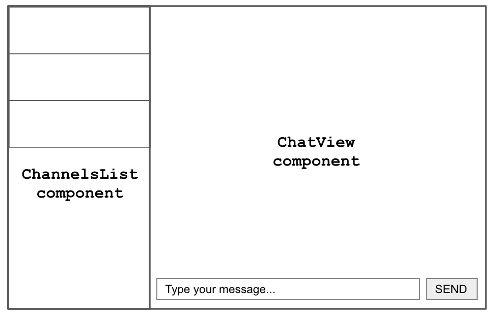

The final part in the series, following [Part I](https://medium.com/@cp.vibert/software-engineering-at-eko-pandemic-edition-part-i-75b8f4f578e6) and [Part II](https://medium.com/@cp.vibert/software-engineering-at-eko-pandemic-edition-part-ii-db7197a8f329).

> _During the few months that I stood at my desk in the kitchen, I worked on 3 projects all with very different tech stacks. I wrote some good code and I wrote some bad code. I lost what feels like years of sleep, but more importantly, I gained what feels like years of experience.
> I want to share some of these experiences and pass on some useful tips that I picked up along the way._

## Instant messaging and video conferencing with Upstra and Jitsi

Building a web application that supports instant messaging and video calls is a daunting task, especially when you’ve only got the weekend to do it.

That’s why during my second ‘pandemic project’, it was particularly important to pick the correct tools for the job. Thankfully, one of [Amity’s](https://amity.co/) core products is a workplace communication tool [Eko](https://amity.co/eko), meaning we had some good options to choose from right away:

1. For messaging, we would use our own SDK: [Upstra](https://docs.upstra.co/) (then called SonarKit).

1. For video calls, we would use the open-source [Jitsi Meet API](https://github.com/jitsi/jitsi-meet).

### Messaging with Upstra SDK

The Upstra Messaging SDK promises to take care of the complex stuff required for an instant messaging service— everything from messaging synchronization logic to server infrastructure. This leaves you as the developer with some simple APIs to create and join channels (chats), send and receive messages, and even flag, edit and delete messages.

Like any other, our chat application UI was made up of two main features:

1. A list of all channels (chats) that the user is part of (shown on the left-hand side)

1. A chat view where a user sends and receive messages

<small>UI design was never my strongest skill.</small>
 

Using the Upstra Web SDK, each of these features can be built as a single React component. Starting with feature 1 — the list of channels — the code for the component typically looks something like this:

`gist:cpv123/b662d9f3434df5eda29677bcb36400ee#ChannelsList.js`

All of the Upstra SDK logic happens in a single `useEffect` between lines 12-19 where we do 3 things:

1. Get a list of all channels for the current user (line 13), which comes in the form of a ‘[LiveCollection](https://docs.upstra.co/web/liveobjects#livecollection)’.

1. Listen for changes to this LiveCollection of channels (line 14), and when a change occurs (e.g. new channel, removed channel, modified channel), store the new list of channels in the component state as an ordinary array.

1. Dispose of the LiveCollection when the component unmounts (line 18). The `dispose` method will unsubscribe all listeners and stop all internal observers — this is important to prevent potential memory leaks and performance issues.

After this, we’re left with just plain React: an array of channels stored in the component state from which we render a list of channel components.

For the second feature — the chat view itself — there is a bit more code but the Upstra part remains similar. The component will need to do the following:

1. Join the channel that we want to participate in

1. Get a list of messages for the channel, and watch this list (LiveCollection) for updates. Given that there could be many messages, we will make use of the LiveCollection’s built-in pagination methods.

1. Allow new messages to be sent

`gist:cpv123/0123e39786ce3c3d7e8921ea3ef1adba#ChatView.js`

Most of the Upstra logic now lives in the `useEffect` between lines 26-41. This is where we get a list of messages — as we did earlier with channels — but this time we also check to see if the list ‘has more’ than just that returned initially.

For all LiveCollections, Upstra paginates the lists by returning only 20 items at a time, but also offers some convenient methods for handling this pagination. The code above demonstrates this for the messages LiveCollection:

1. Load the most recent messages (line 28) which will be a maximum of 20

1. Check to see if there are more pages of messages (line 31)

1. If there are more pages, then store the LiveCollections’ `nextPage` method as a `loadMore` function to use later (line 34 and 37)

We pass this `loadMore` function to the `MessagesList` component, which uses it to fetch more messages as the user scrolls up through a conversation. This is achieved easily using the `InfiniteScroll` component from [react-infinite-scroller](https://www.npmjs.com/package/react-infinite-scroller) or something similar:

`gist:cpv123/f6390fc53afadb8b73ac28af2562f717#MessagesList.js`

What’s useful is that when the user scrolls up and more messages are fetched using the `nextPage` method, the `MessagesLiveCollection.on('dataUpdated')` event will be triggered with a new array containing both the old messages and the 20 new messages. This means that we don’t lose the more recent messages that a user will likely scroll back down to.

### Video conferencing with Jitsi Meet API

The [jitsi-meet](https://github.com/jitsi/jitsi-meet) library is a reminder of how great the open source community is — it’s a library that allows you to easily embed fully-featured video conferencing into an application for free, and with no user accounts required.

There are three steps required for embedding Jistsi Meet into an application:

1. Load the Jitsi Meet library

1. Create an HTML ‘container’ element for the Jitsi Meet iFrame

1. Initialise the Jitsi Meet API — telling it where to render (into the container element from step 2) and with what configuration.

The Jitsi Meet library must be loaded using a script tag:

    

In our case, the Jitsi video conferencing wasn’t the app’s only feature, meaning that a user visiting the app would not necessarily need to use Jitsi at all.

Given this, we didn’t want to simply add this script into the application’s HTML body, otherwise, it would always be loaded whether or not the user needs it.

Our solution was to use [react-render-props-script-loader](https://github.com/jcoreio/react-render-props-script-loader) to load the library only when the Jitsi component itself is being rendered — in other words, only when the user is about to use Jitsi video.

`gist:cpv123/5896c794d27fd81366f1cdeb5ee557a0#JitsiContainer.js`

Step number 2 is when we can define where the Jitsi iFrame will render, and with what styling.

In the above code, we render a `JitsiView` component once the library has loaded. This `JistiView` component will render the Jistsi Meet iFrame — the Jitsi Meet library handles mounting the iFrame, we just need to give it a place to be mounted.

`gist:cpv123/f3670fe6945bce0ab7a212beed47ab37#jitsi-view-render.js`

We define a div element, giving it an id making it easy to find within the DOM. In step 3 we pass this node to the Jitsi API as the ‘parent node’ for the iFrame:

    parentNode: document.querySelector('#jitsi-mount')

We also wrap this to-be parent node in styled `JitsiViewWrapper` component which applies some styles to itself, the div container and the iFrame within:

`gist:cpv123/5069b3b0dddf13e513a8ab40070e5934#JitsiViewWrapper.styles.js`

By the time we reach step number 3, the library is loaded and the Jitsi iFrame has a place to render. We can now let the user start and join a video conference.

The logic is again within the `JitsiView` component, where we initialise the Jitsi Meet API to create a room as the component mounts, add some event listeners for joining and leaving the room, and finally ensure that we dispose of the API before the component unmounts.

`gist:cpv123/5ee56acb4d03f4324f16df72463e69e8#JitsiView.js`

Whilst we’ve only made use of two basic event listeners — conference joined and conference left — there are many more which are [documented here](https://jitsi.github.io/handbook/docs/dev-guide/dev-guide-iframe).

**Advice for using the Jitsi Meet API**: be aware of the browser limitations. The Jitsi Meet library is only guaranteed to work for users on a desktop device using a recent version of Chrome or Chromium.

Reportedly, if some participants of a video conference are using an unsupported browser, it can affect everyone in the conference.

There’s a small summary of browser support [here](https://github.com/jitsi/jitsi-meet/wiki/Browser-support).

And that’s all from my ‘pandemic projects’. Lots of code, lots of lessons learned.
