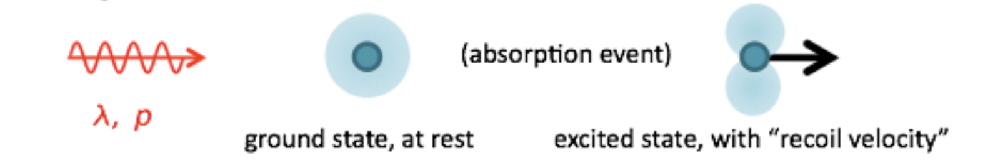
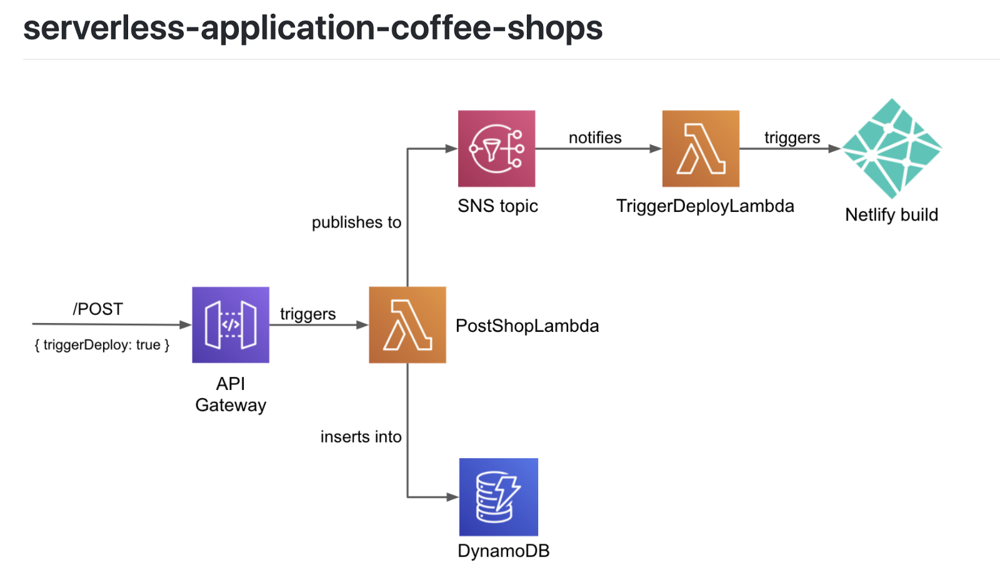
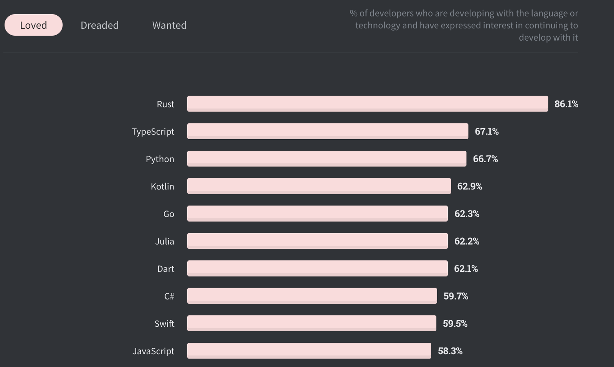

For the last few years, I've tried hard to keep up with the React ecosystem, and more generally the surrounding JavaScript ecosystem that seems to move impossibly fast.

For most of that time, I've also promised myself that I'll learn some new languages, try some new technology - anything that puts me outside of my JavaScript comfort zone.

> ####_Recently I came across the phrase "JavaScript fatigue" and immediately self-diagnosed._

But for the most part, this hasn't happened. This hasn't happened because keeping up with React and JavaScript can be exhausting - sometimes I'm genuinely afraid of falling behind the curve, leaving me with little time and energy to explore other things.

### The tipping point

The release of the Recoil library for React state management was when I realised. Not so long ago, I'd have gone straight for the docs, tried it out, and explored the source code to see how things are working underneath. But this time I simply didn't have the motivation.

All I can tell you about Recoil now is that people seem to be loving it and that it uses things called 'atoms', which maybe explains the name Recoil?

<small>The first-ever overlap between my Chemistry degree and my job.</small>
 

I should make it clear - just in case my employer is reading this - that I'm still going to love my job of JavaScript and React. From Monday to Friday I'll be as dedicated as ever, learning and trying new things. But outside of working hours, my attention will probably be elsewhere.

### So what's next?

I'm still figuring this out, but I've got a few ideas:

---

<strong>1. Doing some more writing.</strong> Finish off my half-written blog posts, and hopefully have some new content to write about soon.

---

<strong>2. Using AWS free tier to build large-scale architectures on a small scale.</strong> I've had some fun with this in the past, like over-engineering a simple list of coffee shops with SAM using with lambda functions, DynamoDB, and SNS. This time I'll be sure to write my lambdas in Go rather than JavaScript.

<small>Overengineering can be fun.</small>
 

---

<strong>3. Learning Rust.</strong> I want a language that's low-level, and also want to understand why this keeps happening:

<small><a href="https://insights.stackoverflow.com/survey/2020">Stack Overflow Developer Survey 2020</a></small>
 

For 5 years in a row, Rust has been voted the most loved language in the Stack Overflow Developer Survey.
I'm also pretty excited by the fact that Rust compiles to WebAssembly, which is another thing I've been meaning to try out.
For an easy transition from React, I might start off with Yew. This is a Rust framework for building web applications and was inspired by React - it's a component-based framework and uses a JSX-like syntax.
Or for a not-so-easy transition, maybe I'll try building a CLI tool with Rust.

---

<strong>4. Building a mobile app with Flutter.</strong> I've never been particularly interested in mobile development, which is exactly why I'm now tempted to give it a try. 
What's appealing about Flutter is that it means I don't have to make the additional decision of iOS vs Andriod - I get them both. And also the Dart language looks fun.

---

Maybe all or just some of these ideas will work out. Maybe in a few months, I'll be reading the Recoil docs and back in my JavaScript comfort zone.
But whatever happens, right now I'm ready to let myself fall behind the React curve for a while in exchange for learning some new things.
