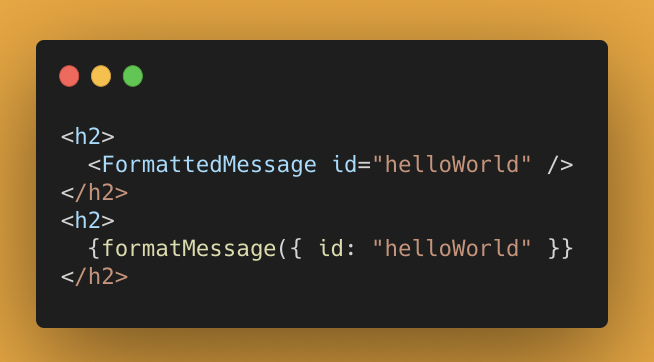
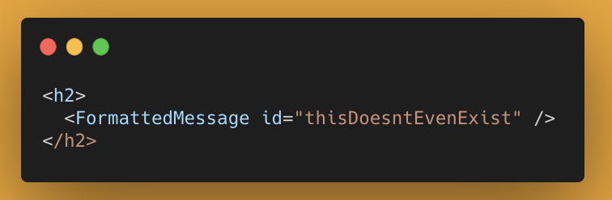
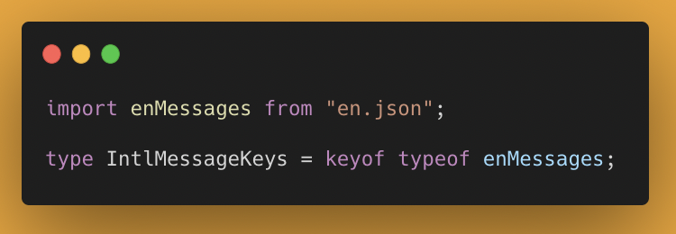
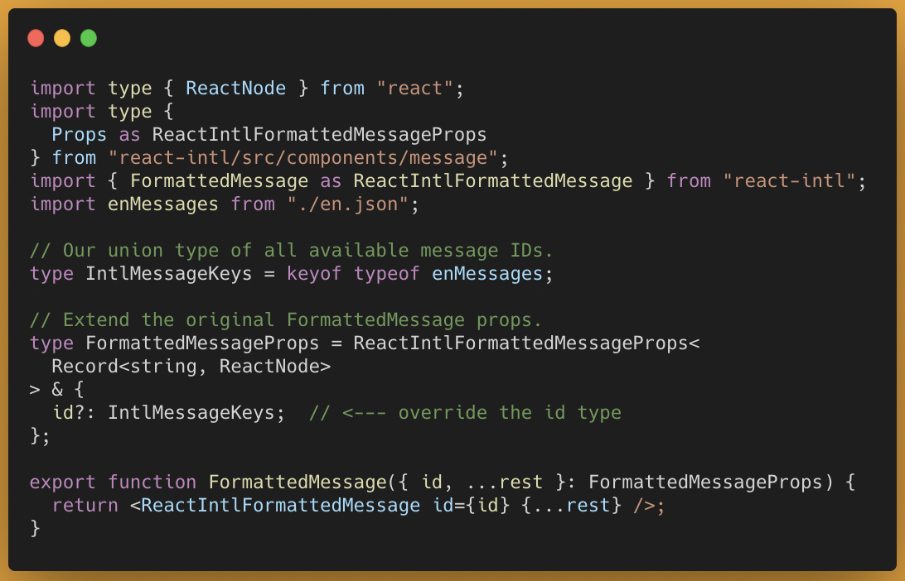
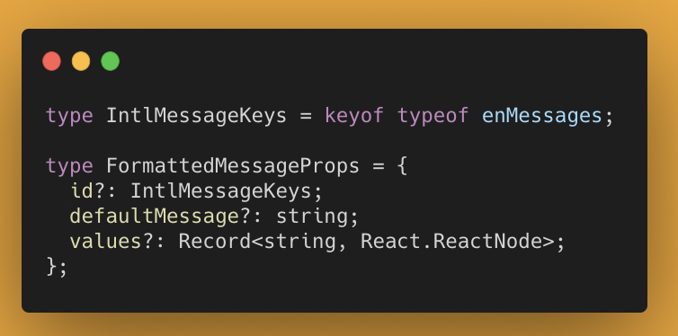
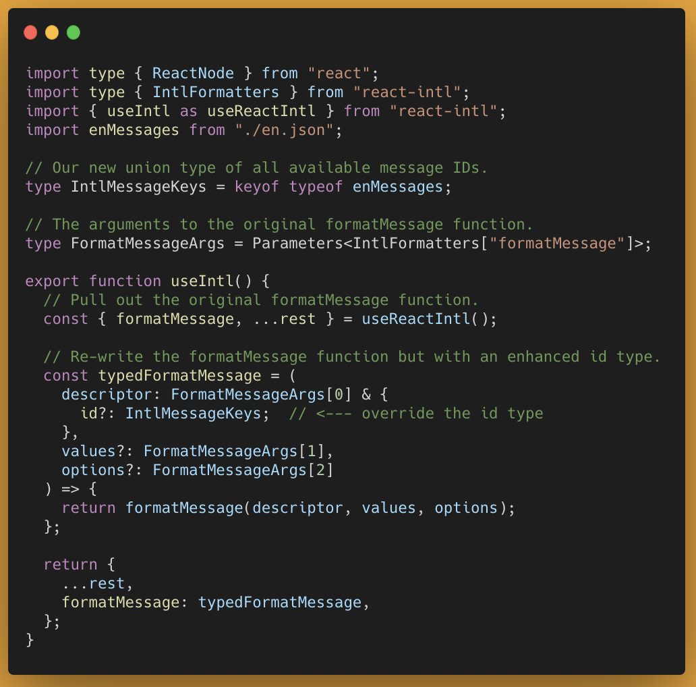
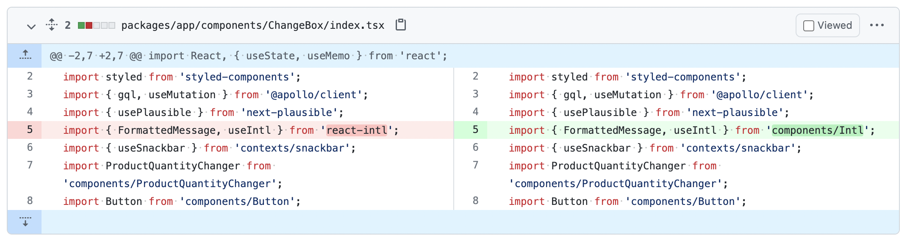
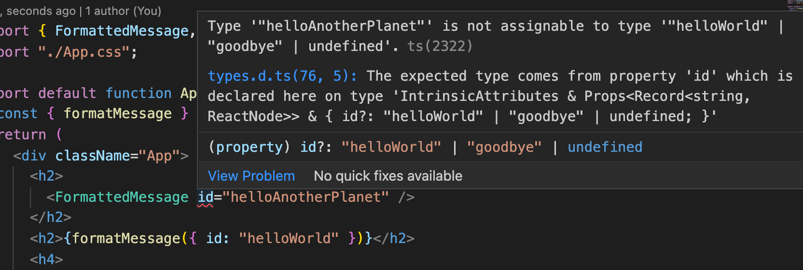

_**TLDR;**_ by creating a wrapper around [react-intl](https://www.npmjs.com/package/react-intl)’s `FormattedMessage`&nbsp; component and `formatMessage`&nbsp; function, you can add type-safety so that only valid translation message IDs are allowed. Here’s an [example repo](https://github.com/cpv123/typed-react-intl-keys) and [some gists](https://gist.github.com/cpv123/afccb1a87d235b9300547f00180c3b99).

With react-intl, you can translate messages with the `FormattedMessage`&nbsp; component or with the `formatMessage`&nbsp function. Either way, you have to provide an id for the message, which is ordinarily of type `string | number`



This means that you can pass any string or any number, even if a message doesn’t exist for that ID...



But by knowing all of the possible messages IDs, we can add additional type-safety to the `id`&nbsp; prop/argument so that it’ll only accept values that actually exist in our translation files. As an added benefit, we’ll also get IntelliSense from our IDE when inputting the argument value (as you’d expect when using TypeScript).

From a typical JSON file containing translation messages:

```
// en.json
{
  "helloWorld": "Hello world!",
  "goodbye: "Goodbye"
}
```

we can create a union type all of messages IDs:



### A type-safe FormattedMessage component

For each translation component/function, we can write a light wrapper that will enhance the underlying `react-intl`&nbsp; function by adding a more specific typing to the `id`&nbsp; argument, whilst leaving all other types the same.

For the `FormattedMessage`&nbsp; component, that looks like this:



<center><small><a href="https://gist.github.com/cpv123/afccb1a87d235b9300547f00180c3b99">https://gist.github.com/cpv123/afccb1a87d235b9300547f00180c3b99</a></small></center><br />

It looks complicated, but that’s mostly because of the `FormattedMessageProps`&nbsp; type that we’ve created based on the original component’s props. To make sure that we’re matching the original prop types exactly, we’ve imported them directly from `react-intl/src/components/message`&nbsp; and then enhanced the type of `id`&nbsp;.

If your use of the `FormattedMessage`&nbsp; component is relatively simple, you could just define the complete props type yourself and it’ll probably be enough to meet your needs:



### A type-safe formatMessage function

Providing a type-safe wrapper for the `formatMessage`&nbsp; function is slightly more work because the function itself is returned from the `useIntl`&nbsp; hook:



<center><small><a href="https://gist.github.com/cpv123/afccb1a87d235b9300547f00180c3b99">https://gist.github.com/cpv123/afccb1a87d235b9300547f00180c3b99</a></small></center><br />

Here we enhance the type of the descriptor argument so that the id option uses our new `IntlMessageKeys`&nbsp; type. To ensure that all other arguments remain the same, we use TypeScript’s `Parameters`&nbsp; utility type to extract the argument types from the original function type and access them one by one.

### Using the new functions

Because we made sure that the function signatures haven’t changed, we can use our new `FormattedMessage`&nbsp; and `formatMessage`&nbsp; in the exact same way as we’d use the original ones. Assuming we defined them both in the same file, we can just replace the import statement from `react-intl`&nbsp; to our new local file:



And once we do, the benefits of this work will be clear:



With our new translation component and function, only valid message IDs are accepted, and our IDE will be sure to help us out. No more risk of misspellings and accidentally using message IDs that don’t exist. TypeScript as you’d expect.
