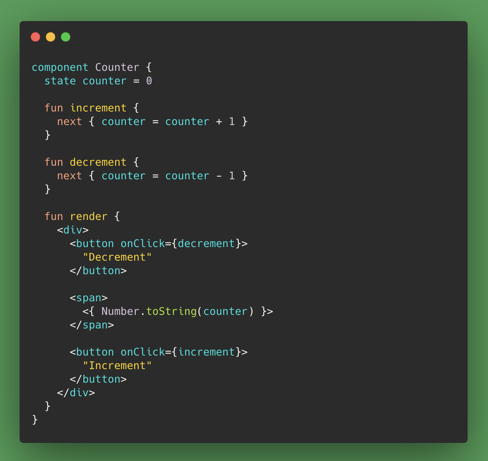
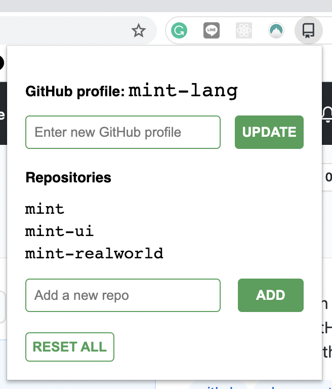
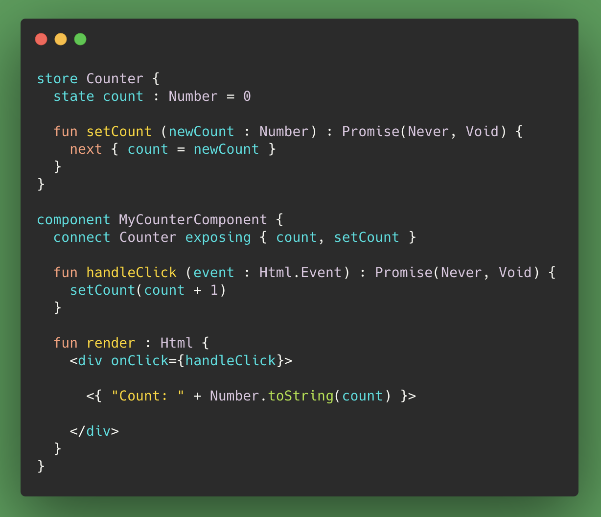
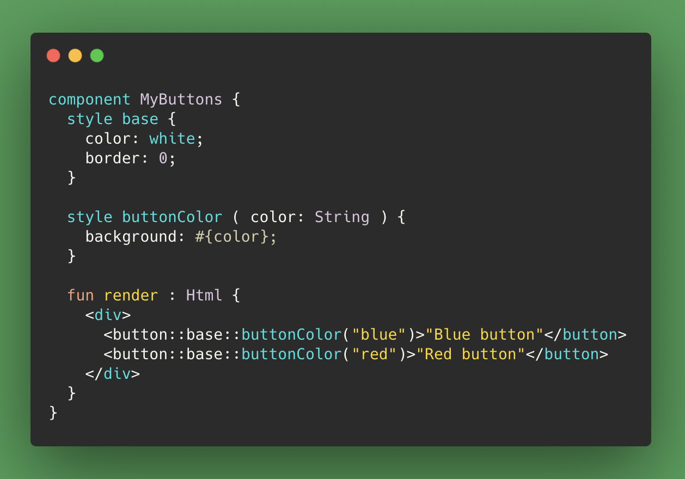
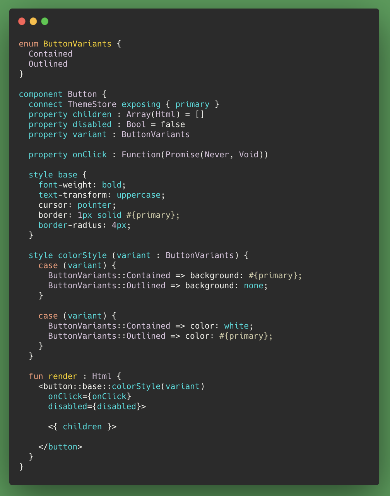
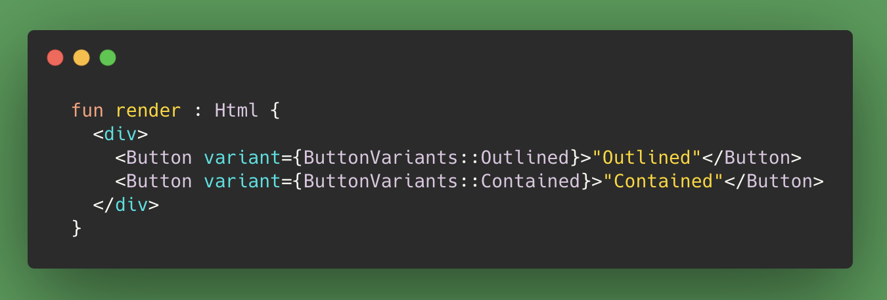
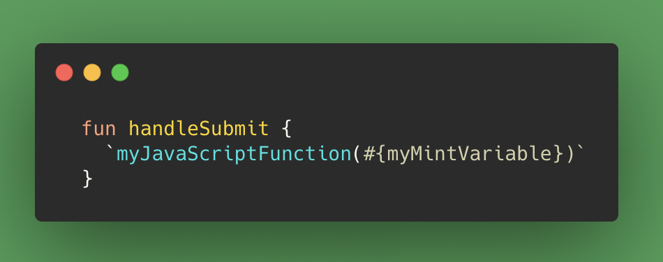

<small>Photo by <a href="https://unsplash.com/@lucavolpe?utm_source=unsplash&utm_medium=referral&utm_content=creditCopyText" target="_blank" rel="noopener noreferrer">Luca Volpe</a> on <a href="https://unsplash.com/s/photos/mint-cocktail?utm_source=unsplash&utm_medium=referral&utm_content=creditCopyText" target="_blank" rel="noopener noreferrer">Unsplash</a></small>
 

Recently, I used [Mint](https://www.mint-lang.com/) to build a small web application, and it was definitely the “refreshing” experience that is advertised. Mint is a relatively unheard-of programming language for building web applications. It’s a typed language, it compiles to JavaScript, and it has many essential features built in.

All of this means that with Mint, you can build web applications _very quickly_.

## Why Mint?

I tried out Mint because I wanted a change from the all-too-familiar JavaScript/TypeScript/React/Vue ecosystem. Mint offered just the right amount of change. It’s an entirely different language and yet a UI component written with Mint looks quite similar to one written with React:

Often when looking for a break from JavaScript web development, people choose to try out the [Elm](https://elm-lang.org/) programming language. It is similar to Mint in a number of ways, like being typed and functional. I tried Elm once but found that my progress was slow because it was difficult to learn and there was lots of boilerplate code. Mint felt like the opposite of this.

## What Did I Build?

I _rebuilt_ a Chrome extension. I used Mint to build the “popup” that appears when you click on the extension icon in your toolbar, which is essentially just a small single-page web application.

In [the source code](https://github.com/cpv123/github-go-chrome-extension), you can see more about the extension and compare the original JavaScript version with the new and improved Mint version.

In my next article, I’ll explain how to build a Chrome extension using Mint. Today, we’re focusing on what I liked about building a web application with Mint in general.

The [Mint website](https://www.mint-lang.com/) nicely shows off all that Mint has to offer, both as a language and web development framework. There are many cool features to choose from, but here’s what I found particularly great:

- The lack of external dependencies because so many features are built in

- The JavaScript interoperability

## Built-In State Management

Coming from React, where `npm install` is a significant part of the job, it was nice to see that with Mint, nearly everything is built in. This means very few external dependencies (if any at all).

Mint offers an incredibly simple global state management solution, like Redux, but with less worry about immutable data and properly “connecting” components.

With Mint, you can define [stores](https://www.mint-lang.com/guide/reference/stores) that contain application state and some functions to update this state. Any component that needs to access this state or needs the ability to update it can easily connect to the relevant store with the `connect` and `exposing` keywords. When the data in a store changes, the connected components are re-rendered with the new values.

Usually, you would define the store and component in separate files, but for the sake of a small example:

Notice that the state value is updated using the `next` keyword, which is specifically for safely mutating state.

## Built-In Styling and CSS

The built-in styling solution was definitely a highlight for me: CSS scoped to the component in which it’s defined, conditional styling based on arguments/props, media queries, nested selectors, and real CSS syntax (e.g. `align-items` and not `alignItems`).

It felt like having the power of [styled-components](https://styled-components.com/) but without the need for an `npm install`.

Here’s a relatively basic example that shows how you can assign CSS values according to arguments:

Taking it further, you can use a component’s props and state values from a store to style components. This next example shows how a button component will vary in style according to:

1. The application’s primary colour, configured in a global “theme store.”

1. The button’s `variant` prop whose values are defined by the `ButtonVariants` enum.

We can render this button component as 'contained' or 'outlined', as per the allowed values in the ButtonVariants enum:

Styling and state management are just two examples of Mint’s built-in functionality. Mint also comes with built-in routing, a code formatter, a test runner, a documentation tool, and much more.

## JavaScript Interoperability — Writing JavaScript Within Mint Code

For most people, this would probably be a “nice to have” feature, but for me, it was essential given that I was building a Chrome extension that would use the JavaScript Chrome APIs.

Here’s a generic example of JavaScript interoperability where a Mint function called `handleSubmit` calls a JavaScript function and even passes an argument that comes from a Mint variable:

Mint actually offers a [few different ways](https://www.mint-lang.com/guide/reference/javascript-interop) to interact with JavaScript, and here we’re showing the most basic of them: inlining JavaScript code by wrapping it with backticks. This works because Mint compiles to JavaScript. When you build a Mint application, everything ends up as JavaScript anyway.

While this inlining method is quick and easy to use, it relies on type inference, which might not always be perfect. A type-safer way to use JavaScript code in Mint is to convert JavaScript objects to typed values using [decode expressions](https://www.mint-lang.com/guide/reference/javascript-interop/decode-expression).

## Conclusion

Overall, my experience with Mint was overwhelmingly positive. Coming from TypeScript and React meant that it was quick and easy to learn, with many familiar concepts built into the core of the language.

What I built was simple and very small, and so I can’t say for certain that Mint is just as good for large-scale applications that might have complex routing, data fetching, performance considerations, etc. But from what I see, there’s no reason why Mint isn’t ready for this.

The official [mint-ui](https://ui.mint-lang.com/) component library has just been released and the language appears to be gaining some traction. I hope that 2021 will be a good year for Mint

[**Mint vs JavaScript (stack)**
*Comparing Mint with JavaScript. Tagged with mintlang, javascript, webdev.*dev.to](https://dev.to/gdotdesign/mint-vs-javascript-stack-15id)

[**Guide**
*This page is an introduction to what Mint is. Mint is a language specifically created for writing single-page…*www.mint-lang.com](https://www.mint-lang.com/guide)
